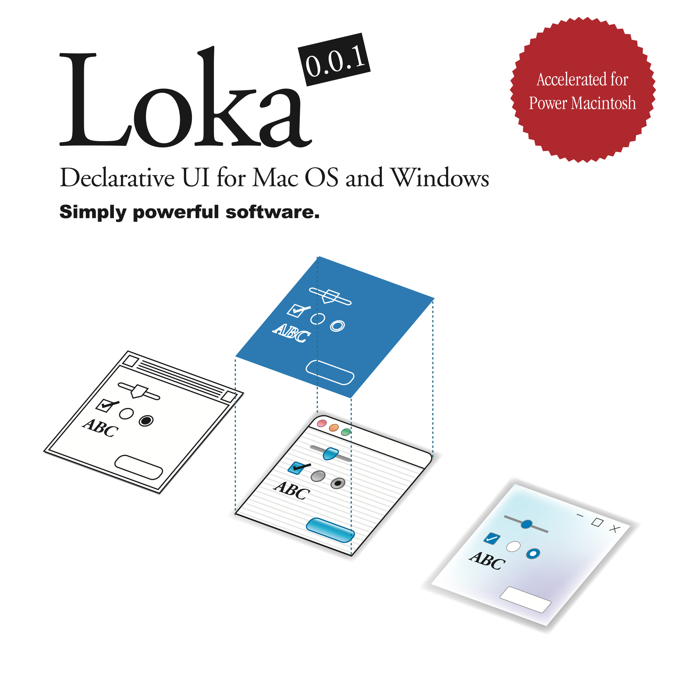

# Loka

<picture>
  <source media="(prefers-color-scheme: dark)" srcset="assets/Hero-dark.svg">
  <source media="(prefers-color-scheme: light)" srcset="assets/Hero.svg">
  
</picture>

> [!IMPORTANT]
> This framework is still in the proof-of-concept stage. The core is already usable, but broader component coverage, platform support, and some refactoring work are still in progress. Please also see [ROADMAP.md](ROADMAP.md).

## Why Loka?

Loka exists to help application authors spend more time on the software they want to make and less time on incidental platform work. Declarative UI, cross-platform projection, and a C++98-friendly core are not ends in themselves; they are tools for improving productivity, quality, and long-term maintainability.

The goal is to make meaningful application code portable by shape. State ownership, composition, events, resources, and future timelines should be expressed as Loka concepts, while each platform layer projects those concepts into native behavior. A fix or design improvement should usually be made once, tested once in the portable core when possible, and then carried to Classic Mac OS, macOS, Windows, and future targets through the same model.

That matters especially for retro systems. Classic APIs can still build useful applications, but manual state, native handles, resource lifetimes, and platform-specific event code make quality hard to scale. Loka captures those recurring best practices as reusable structure: explicit owners, small boundaries, typed props, state direction, Flow lifetimes, and testable core behavior.

The result should feel modern without hiding the machinery. Application code should read as intent, while reviewers, maintainers, and AI tools can still inspect where state lives, who cleans it up, what becomes dirty, and which platform layer is allowed to reflect it.

## How does it work?

Loka uses a modern statically typed DSL built in C++98 to describe application structure, then projects that structure onto each target OS.

- One meaningful application model is shared across platforms.
- Declarative composition reduces manual UI update bookkeeping.
- Application logic stays in portable C++98 code where practical.
- The public API tries to avoid exposing manual memory management in ordinary app code.
- Strong types carry meaning: node-owned state, borrowed state, props input, flow lifetime, and platform projection are distinct.
- Ownership and lifecycle are explicit enough for human review, automated tests, and AI-assisted analysis.
- The core depends on only a small subset of the STL, helping it stay highly portable across old and new toolchains.
- Each target maps that structure onto native windowing and drawing APIs.
- The core stays neutral while platform layers stay thin.

---

## Bridging Modern Development and Retro Environments

Strong static typing, no exceptions, no RTTI, and only a small STL surface.

### Challenges

- CPU limits on 68k-era systems
- small memory budgets
- older compiler and toolchain constraints such as GCC 4.0-era environments
- explicit error handling and manual memory management
- a minimal dependency surface

### Approach

- a modern statically typed DSL built in C++98
- strong compile-time type safety despite a C++98 core
- no exceptions and no RTTI in core DSL paths
- declarative UI and application structure
- a small, unified concept set instead of many special-purpose mechanisms
- deterministic lifecycle management behind app-facing declarative APIs
- logical UI design separated from OS-specific projection
- portable application logic with thin platform layers
- reliance on only a small subset of the STL

For deeper design notes, see [docs/ProgrammingGuide.md](docs/ProgrammingGuide.md) and [docs/environments.md](docs/environments.md).

---

## Supported Target Environments

Loka is designed around explicit target environments rather than assuming one modern desktop baseline.

Status terms:

- `active`: implementation exists in this repository and is part of the current development loop.
- `headless`: non-UI/core test target only.
- `planned`: design direction, not a supported runtime yet.

| Environment | Status | Notes |
| --- | --- | --- |
| Modern Windows / Win32 | `active` | Native Win32 projection path. Windows XP-class compatibility is tracked as a legacy build target. |
| macOS / Cocoa | `active` | Native macOS projection path. Mac OS X 10.4 Tiger or newer and PowerPC G3 or newer are supported targets. |
| Classic Mac OS / Toolbox | `active` | Built through Retro68 for System 7 or later on 68k and PowerPC-style Classic targets.<br>Practical mainstream target: 68030-class systems and later (and PPC601 / 603e-class PowerPC Macs). Low-end 68k (68000 / 68020) stays an important constraint and validation path.<br>All bundled examples are runtime-verified on a 68030 PowerBook 180c (33 MHz, 4 MB RAM) with no 68k-specific optimization pass. |
| Linux / WSL | `headless` | Used today for core and Flow DSL tests. Full native UI projection is planned, not part of `0.0.1`. |
| iOS / iPadOS, Linux desktop UI, Windows Mobile-class systems, game-oriented backends | `planned` | Future ports should reuse the same Node / Boundary / State / Flow model rather than adding platform-specific application models. |

For exact build and workflow details, see [docs/environments.md](docs/environments.md). Classic Mac OS and Retro68-specific notes are in [docs/retro68.md](docs/retro68.md).

---

## Building

Loka uses a **CMake + Ninja** based build system.

### Prerequisites

For the main development and test workflow:

- CMake 3.19 or newer when using `CMakePresets.json`
- Ninja
- A C++ compiler capable of building C++98 code

The core is intentionally C++98-friendly and already builds with older toolchains such as GCC 4.0-era environments. Modern host builds can use current Clang, GCC, or MSVC.

Platform-specific builds also need the matching native toolchain:

- macOS: Xcode or Xcode Command Line Tools
- Windows: Visual Studio Build Tools or Visual Studio, usually from a matching Developer Command Prompt. Launching VS Code with `code .` from an ARM64 Native Tools prompt builds native ARM64 on Windows on ARM; x64/x86 Cross Tools prompts can be used for x64 or x86 builds.
- Classic Mac OS targets: Retro68, typically from a Linux, WSL, Docker, or container-based environment

For a quick headless test build on Linux/WSL:

```sh
cmake --preset testing        # or: cmake -S . -B build/Testing -G Ninja -DTEST_BUILD=ON
cmake --build --preset testing
ctest --preset testing
```

Most lifecycle bugs only fail hard under AddressSanitizer, so run the same
suite through the ASan preset before landing scene/state/flow changes:

```sh
cmake --preset testing-asan
cmake --build --preset testing-asan
ctest --preset testing-asan
```

On macOS and Windows the same suite runs as the `LokaTestsMacOS` /
`LokaTestsWin32` targets:

```sh
# macOS                              # Windows (from a VS Developer Prompt)
cmake --preset macos-debug           cmake --preset win32-debug
cmake --build --preset macos-tests   cmake --build --preset win32-tests
ctest --preset macos-tests           ctest --preset win32-tests
```

The same presets drive VS Code's CMake Tools integration: pick the matching
configure/build/test preset and the suite appears in the Testing panel.

Development, build, and target environment notes are documented in [docs/environments.md](docs/environments.md).

Classic Mac OS and Retro68-specific notes are documented in [docs/retro68.md](docs/retro68.md).

macOS script entry points are documented in [scripts/macos/README.md](scripts/macos/README.md).

---

## License

This repository is released under the **MIT License**.
