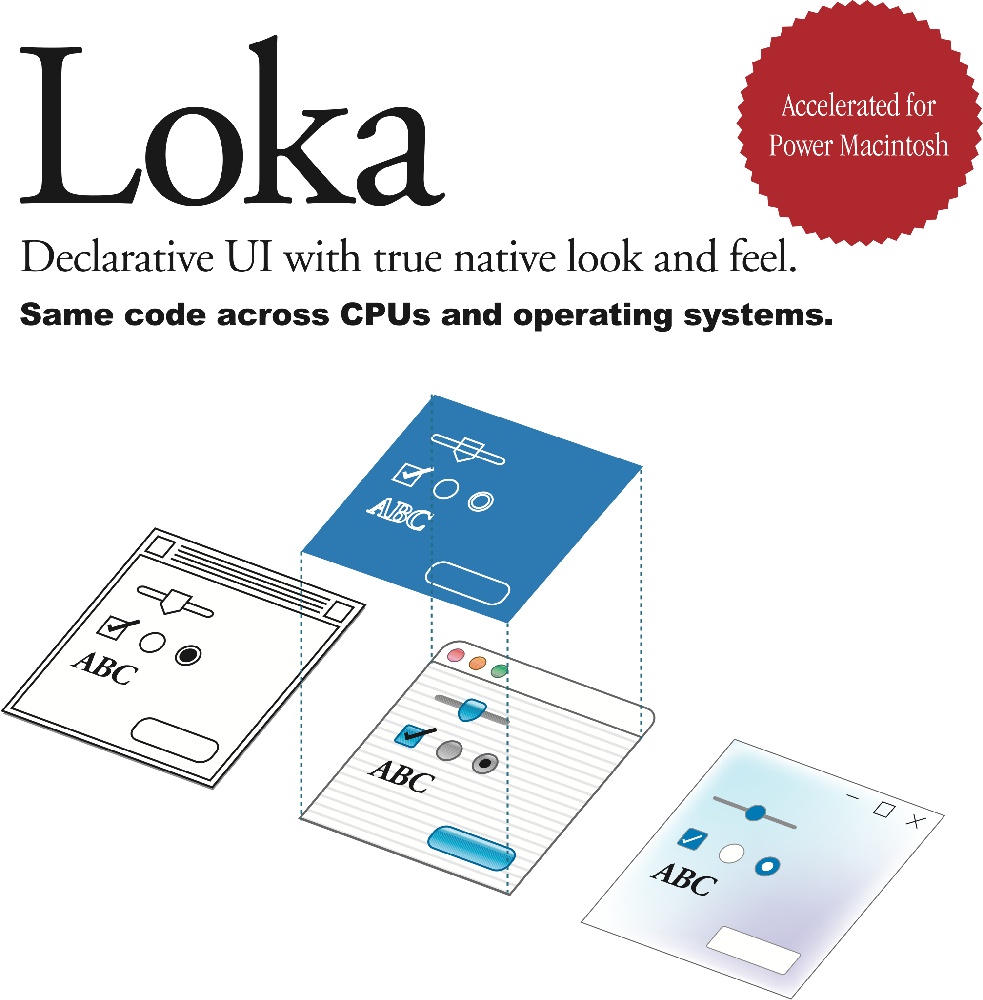

# Loka

[](https://github.com/cubenoy22/Loka/actions/workflows/linux.yml)
[](https://github.com/cubenoy22/Loka/actions/workflows/macos.yml)
[](https://github.com/cubenoy22/Loka/actions/workflows/windows.yml)
[](https://github.com/cubenoy22/Loka/actions/workflows/toolbox.yml)

<picture>
  <source media="(prefers-color-scheme: dark)" srcset="assets/Hero-dark.svg">
  <source media="(prefers-color-scheme: light)" srcset="assets/Hero.svg">
  
</picture>

> [!IMPORTANT]
> The current release is
> [v0.0.2](https://github.com/cubenoy22/Loka/releases/tag/v0.0.2), a
> reliability milestone focused on lifecycle, ownership, allocation-failure
> handling, verification, and Win32 UI text. This framework is still in the
> proof-of-concept stage: the core is already usable, but broader component
> coverage, platform support, and some refactoring work are still in progress.
> Please also see [ROADMAP.md](ROADMAP.md).

## Why Loka?

Loka aims to bring new content and creative tools to retro platforms without treating them as novelty targets.

It is not just for GUI applications. Loka is also intended to grow toward animation, video, and game production on G3-class systems and later, where timelines, sprites, models, and characters can be treated as nodes in the same declarative system.

Loka's core idea is to keep the cast of concepts small and meaningful. `Node`, `Boundary`, `State`, `Props`, `Flow`, and platform projection are reused consistently across UI, events, async pipelines, and native integration instead of introducing a new mechanism for every feature.

That consistency is intentional. A `Boundary` is also a kind of `Node`; `NodeState<T>` is the state handle a node uses while storage and tracking remain attached to a lifecycle owner; `FlowSlot<T>` gives long-lived flows the same kind of owner-aware lifetime. The goal is code that feels modern and declarative while still making ownership, cleanup, and update routing explicit.

Loka also treats ownership as information, not merely bookkeeping. A copied
`Held<T>` handle does not anonymously extend a payload's lifetime. The
`Boundary` or `Section` scopes that hold it are the lifetime edges, detach and
reclamation happen on explicit clocks, and testing tools can report
`held-by [section(...)]` instead of only an unexplained reference count. This
keeps sophisticated lifecycle behavior inspectable while remaining bounded
enough for 68k-class targets.

## How does it work?

Loka uses a modern statically typed DSL built in C++98 to declaratively define UI and application structure, then projects it onto each target OS.

- One declarative model is shared across platforms.
- Application logic stays in portable C++98 code.
- The public API tries to avoid exposing manual memory management in ordinary app code.
- Strong types carry meaning: node-owned state, borrowed state, props input, flow lifetime, and platform projection are distinct.
- Owner-scoped resource holds record which declarative scopes keep a payload alive; handle copies are inert views rather than hidden retains.
- The core depends on only a small subset of the STL, helping it stay highly portable across old and new toolchains.
- Each target maps that structure onto native windowing and drawing APIs.
- The core stays neutral while platform layers stay thin.

---

## Bridging Modern Development and Retro Environments

Strong static typing, no exceptions, no RTTI, and only a small STL surface.

### Challenges

- CPU limits on 68k-era systems
- small memory budgets
- older compiler and toolchain constraints such as GCC 4.0-era environments
- explicit error handling and manual memory management
- a minimal dependency surface

### Approach

- a modern statically typed DSL built in C++98
- strong compile-time type safety despite a C++98 core
- no exceptions and no RTTI in core DSL paths
- declarative UI and application structure
- a small, unified concept set instead of many special-purpose mechanisms
- deterministic lifecycle management behind app-facing declarative APIs
- logical UI design separated from OS-specific projection
- portable application logic with thin platform layers
- reliance on only a small subset of the STL

For deeper design notes, see [docs/ProgrammingGuide.md](docs/ProgrammingGuide.md) and [docs/environments.md](docs/environments.md).

---

## Supported Target Environments

Loka is designed around explicit target environments rather than assuming one modern desktop baseline.

Status terms:

- `active`: implementation exists in this repository and is part of the current development loop.
- `headless`: non-UI/core test target only.
- `planned`: design direction, not a supported runtime yet.

| Environment | Status | Notes |
| --- | --- | --- |
| Modern Windows / Win32 | `active` | Native Win32 projection path. Windows XP-class compatibility is tracked as a legacy build target. |
| macOS / Cocoa | `active` | Native macOS projection path. Mac OS X 10.4 Tiger or newer and PowerPC G3 or newer are supported targets. |
| Classic Mac OS / Toolbox | `active` | Built through Retro68 for System 7 or later on 68k and PowerPC-style Classic targets.<br>Practical mainstream target: 68030-class systems and later (and PPC601 / 603e-class PowerPC Macs). Low-end 68k (68000 / 68020) stays an important constraint and validation path.<br>All bundled examples are runtime-verified on a 68030 PowerBook 180c (33 MHz, 4 MB RAM) with no 68k-specific optimization pass. |
| Linux / WSL | `headless` | Used today for core and Flow DSL tests. Full native UI projection is planned, not part of `0.0.2`. |
| iOS / iPadOS, Linux desktop UI, Windows Mobile-class systems, game-oriented backends | `planned` | Future ports should reuse the same Node / Boundary / State / Flow model rather than adding platform-specific application models. |

For exact build and workflow details, see [docs/environments.md](docs/environments.md). Classic Mac OS and Retro68-specific notes are in [docs/retro68.md](docs/retro68.md).

---

## Building

Loka uses a **CMake + Ninja** based build system.

### Prerequisites

For the main development and test workflow:

- CMake 3.19 or newer when using `CMakePresets.json`
- Ninja
- A C++ compiler capable of building C++98 code

The core is intentionally C++98-friendly and already builds with older toolchains such as GCC 4.0-era environments. Modern host builds can use current Clang, GCC, or MSVC.

Platform-specific builds also need the matching native toolchain:

- macOS: Xcode or Xcode Command Line Tools
- Windows: Visual Studio Build Tools or Visual Studio, usually from a matching Developer Command Prompt. Launching VS Code with `code .` from an ARM64 Native Tools prompt builds native ARM64 on Windows on ARM; x64/x86 Cross Tools prompts can be used for x64 or x86 builds.
- Classic Mac OS targets: Retro68, typically from a Linux, WSL, Docker, or container-based environment

For a quick headless test build on Linux/WSL:

```sh
cmake --preset testing        # or: cmake -S . -B build/Testing -G Ninja -DTEST_BUILD=ON
cmake --build --preset testing
ctest --preset testing
```

Most lifecycle bugs only fail hard under AddressSanitizer, so run the same
suite through the ASan preset before landing scene/state/flow changes:

```sh
cmake --preset testing-asan
cmake --build --preset testing-asan
ctest --preset testing-asan
```

The suite also has to survive the configuration the framework actually ships
in, where `assert` and the lifecycle audit are both gone. That is a separate
preset because it discriminates differently, not because it is a faster
`testing`:

```sh
cmake --preset testing-release
cmake --build --preset testing-release
ctest --preset testing-release
```

On macOS and Windows the same suite runs as the `LokaTestsMacOS` /
`LokaTestsWin32` targets:

```sh
# macOS                              # Windows (from a VS Developer Prompt)
cmake --preset macos-debug           cmake --preset win32-debug
cmake --build --preset macos-tests   cmake --build --preset win32-tests
ctest --preset macos-tests           ctest --preset win32-tests
```

The same presets drive VS Code's CMake Tools integration: pick the matching
configure/build/test preset and the suite appears in the Testing panel.

Development, build, and target environment notes are documented in [docs/environments.md](docs/environments.md).

Classic Mac OS and Retro68-specific notes are documented in [docs/retro68.md](docs/retro68.md).

macOS script entry points are documented in [scripts/macos/README.md](scripts/macos/README.md).

## Release-preflight rigs

Maintainers can build and run one exact commit through a configured macOS VM
or Toolbox MAME rig with the common host-side entry point:

```sh
python3 scripts/rig/loka-rig.py run mavericks-10.9 \
  --ref <commit-sha> --mode flow --local-config <macos-local.ini>

python3 scripts/rig/loka-rig.py run toolbox-maciix \
  --ref <commit-sha> --mode flow --local-config <toolbox-local.ini>
```

Machine-local mappings contain VM, SSH, archive, MAME, and golden paths and
must remain untracked. Start from the matching `local.example.ini` under
`scripts/rig/macos/rigs/` or `scripts/rig/toolbox/rigs/`. Successful runs produce a
hashed manifest and presentation artifacts; failed runs retain diagnostic state
when possible. See [docs/LOKA_RIG.md](docs/LOKA_RIG.md) for the lifecycle,
result vocabulary, and adapter-specific setup links.

---

## License

This repository is released under the **MIT License**.
