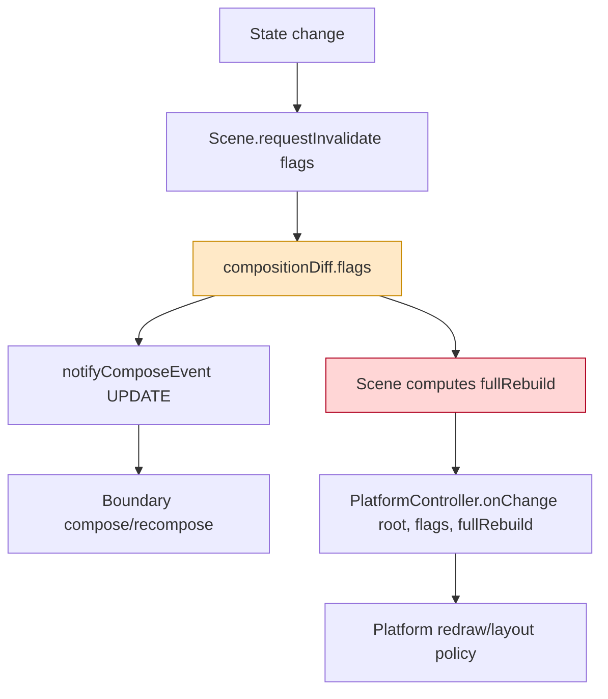
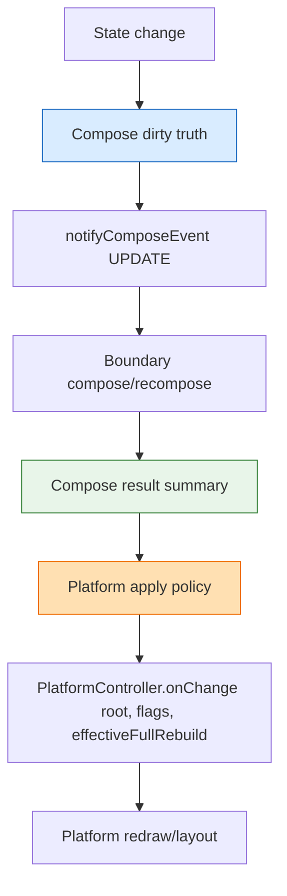
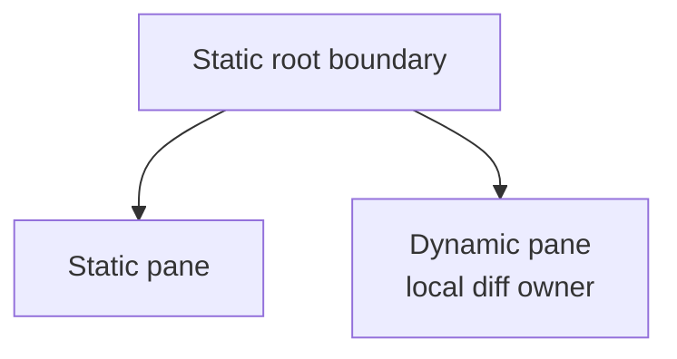
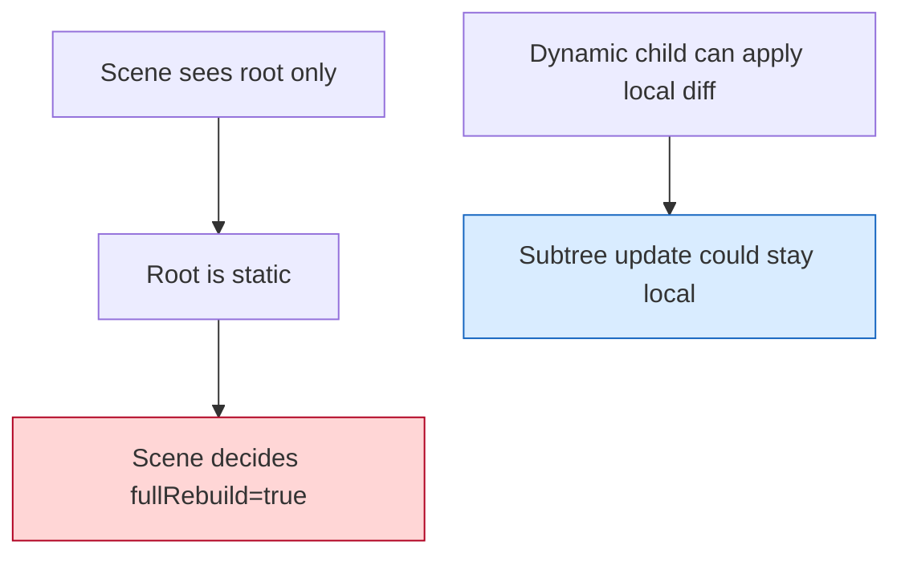
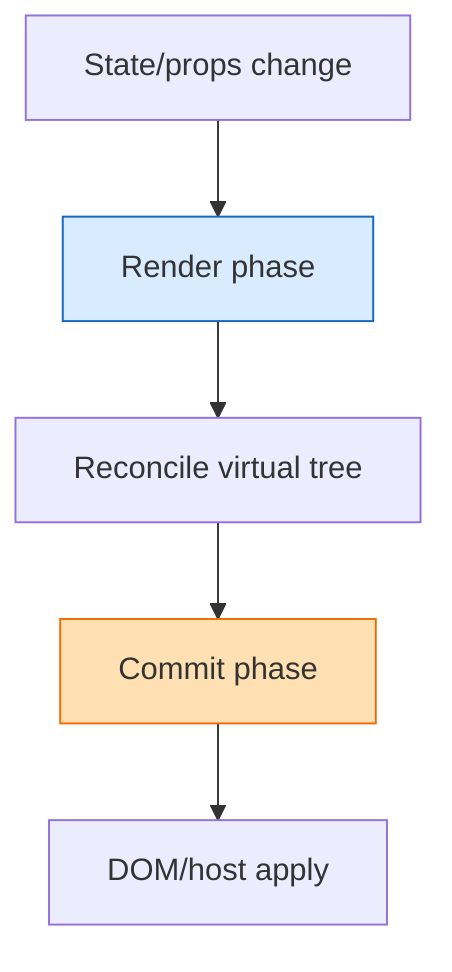
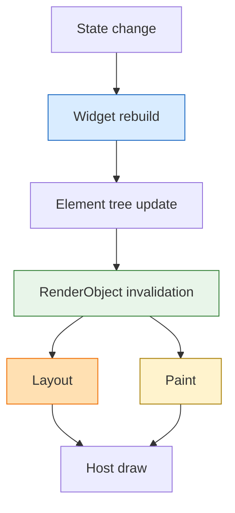
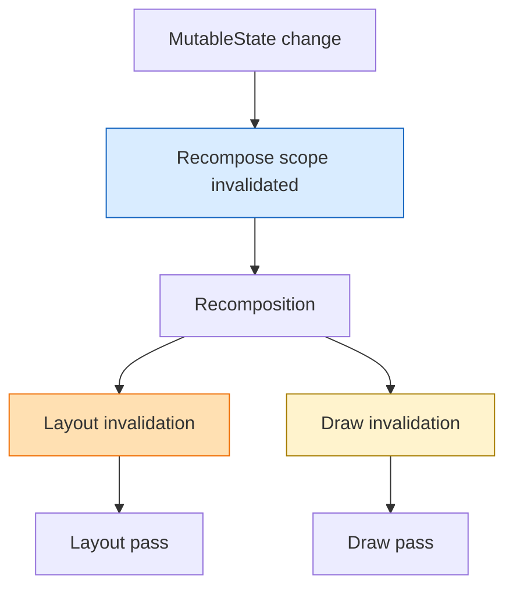

# Compose Truth vs Platform Policy

The current redraw/rebuild confusion comes from mixing two different concepts:

- Compose truth:
  what actually changed in the scene graph (`NODE_DIRTY_CHILD`, `NODE_DIRTY_PROPS`, `NODE_DIRTY_LAYOUT`)
- Platform policy:
  how aggressively the platform layer should rebuild/redraw (`fullRebuild`, rect redraw, context reuse)

These are related, but they are not the same thing.

## Current Loka shape



Problem:

- `flags` should express compose truth
- `fullRebuild` should express platform apply policy
- today they are decided from the same narrow scene-level path, so optimization attempts can accidentally change compose semantics

## Desired separation



Recommended interpretation:

- `flags`: compose truth, preserved until compose is complete
- `effectiveFullRebuild`: platform-only decision, computed after compose/local diff results are known

## Why StaticVsDynamic exposed the problem

`StaticVsDynamic` originally had this shape:



Under a root-only downgrade policy:



This creates a mismatch:

- compose truth says: a child-dirty dynamic subtree can recompose locally
- platform policy says: full rebuild anyway, because the root is static

Changing the root host to dynamic reduces the platform rebuild pressure, but it also changes the sample's meaning, because now the root itself becomes the local-diff owner.

## Comparison with other UI runtimes

### React



Rough analogy:

- render/reconcile = compose truth
- commit = platform apply

### Flutter



Flutter separates:

- rebuild
- render invalidation
- layout
- paint

### Jetpack Compose



Compose also separates:

- recomposition
- layout invalidation
- draw invalidation

## Design options

### A. Keep root-only policy

- Pros: simple, explicit, easy to reason about
- Cons: static root + dynamic child cannot benefit from child-local diff at the scene/platform boundary

### B. Use subtree aggregate downgrade

- Pros: allows dynamic child boundaries to influence scene-level rebuild policy
- Cons: too coarse if "some subtree can diff" becomes "whole scene can avoid rebuild"

### C. Separate compose truth from platform policy

- Pros: preserves `NODE_DIRTY_CHILD` semantics
- Pros: allows platform rebuild decisions to evolve independently
- Pros: closest to how mature UI runtimes behave
- Cons: adds one more conceptual layer

### D. Introduce boundary-level apply contracts

- Pros: most accurate long-term model
- Pros: each boundary can describe whether it handled changes locally
- Cons: heavier design, probably not the first fix to land

## Recommended direction

Start with C.

### Minimal next step

Keep:

- `SceneCompositionDiff.flags` as compose truth

Add:

- a separate platform-facing rebuild decision computed after compose

Pseudo-shape:

```text
refreshComposition():
  flags := collect dirty truth
  notifyComposeEvent(flags)

applyComposition():
  effectiveFullRebuild :=
    decidePlatformFullRebuild(root, flags, composeResultSummary)
  platform->onChange(root, flags, effectiveFullRebuild)
```

### Key rule

Do not let platform optimization rewrite compose truth.

In practice:

- `NODE_DIRTY_CHILD` must remain available to dynamic boundaries
- `effectiveFullRebuild` may still become `false` if compose/local-diff results prove the platform can update locally
