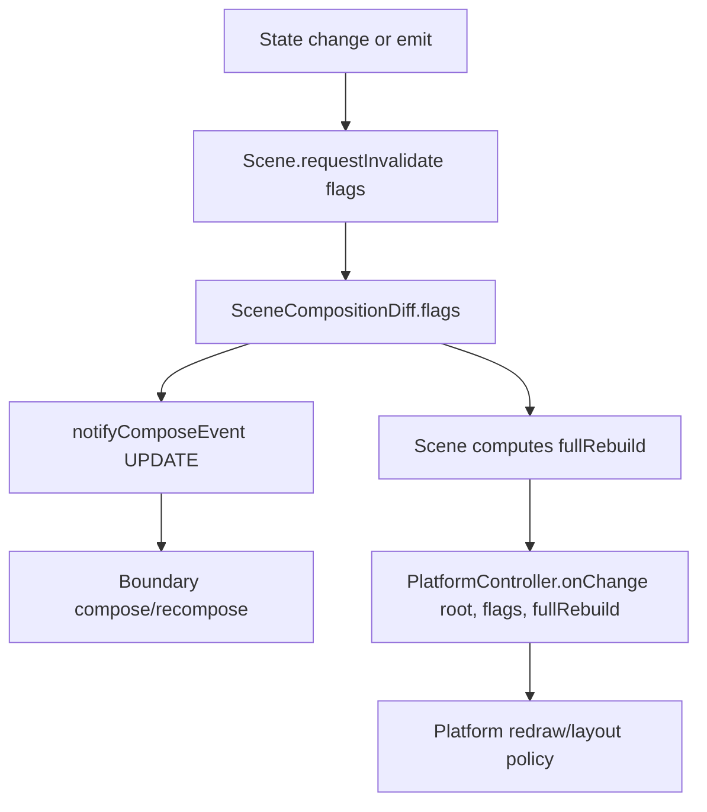
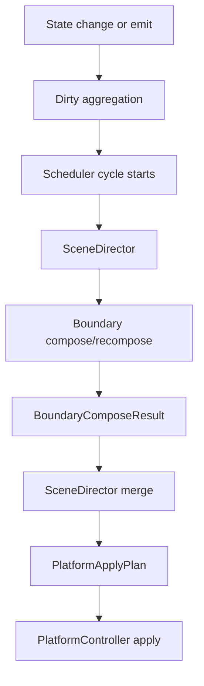
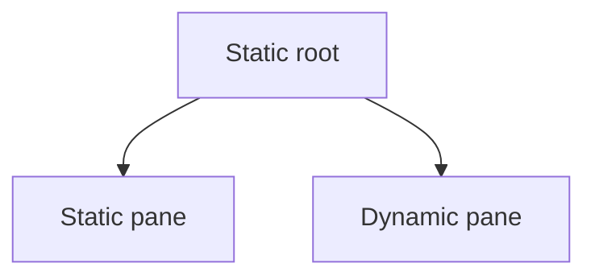
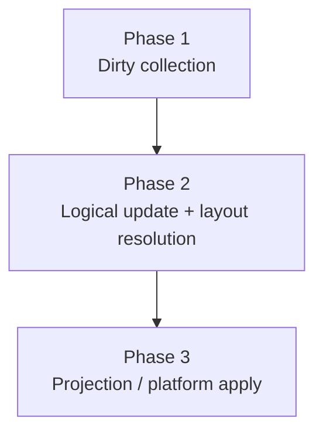
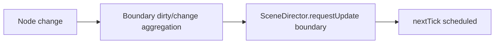
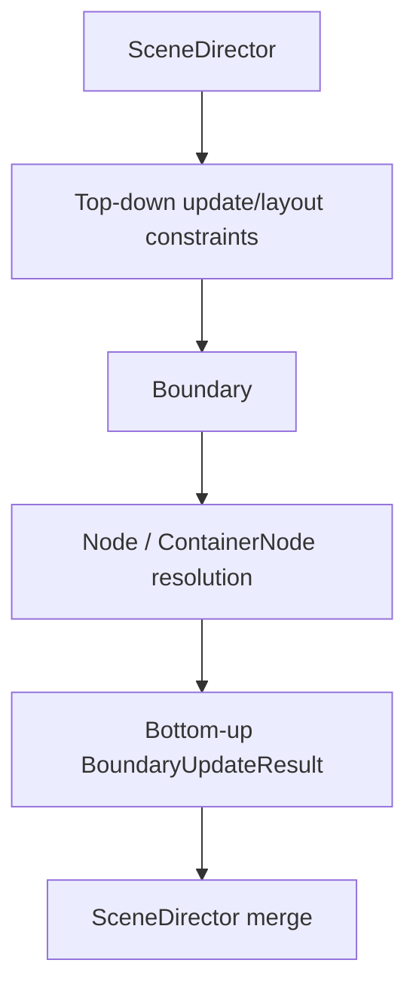
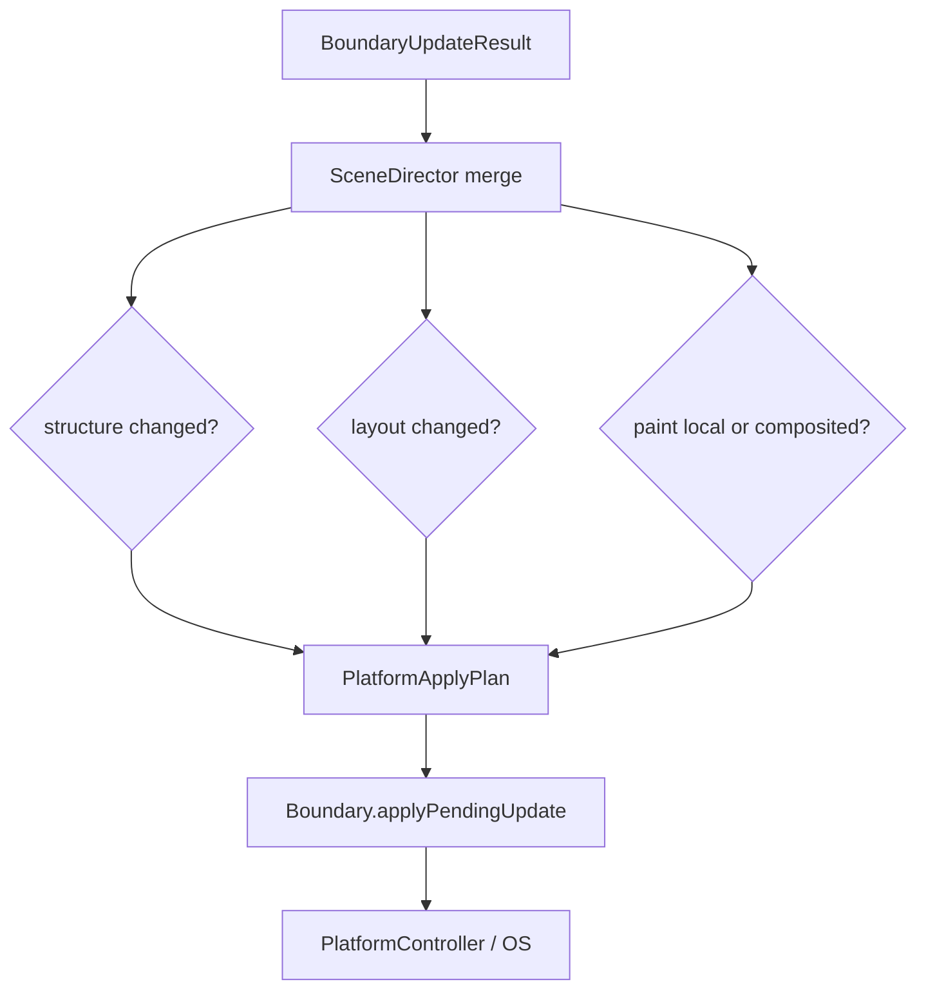

# Update Pipeline Draft

## Problem

Recent redraw and local-diff issues exposed a missing layer in the current scene update model.

Today Loka already has:

- dirty signals (`NODE_DIRTY_*`)
- scheduling (`NextTickTracker`)
- boundary composition / recomposition
- boundary-local diff and rebuild machinery
- platform application (`PlatformController::onChange(...)`)

But it does not yet have a clear scene-level contract between:

- logical composition facts
- platform rebuild / redraw policy

This causes problems such as:

- `NODE_DIRTY_CHILD` needing to remain true for dynamic recomposition
- platform-side code still wanting to downgrade `fullRebuild`
- static roots with dynamic children not fitting cleanly into a root-only rebuild policy
- platform-specific redraw optimizations accidentally influencing compose semantics

## Core idea

Separate:

- compose truth
- platform policy

Compose truth answers:

- what changed logically?
- which boundaries saw child / props / layout dirty?
- did local diff succeed?
- did structure rebuild happen?

Platform policy answers:

- should this cycle be treated as full rebuild or local apply?
- can native contexts be preserved?
- is rect redraw enough?
- can a static-only update be applied immediately?

These are related, but they must not be the same decision.

## Current shape



Weakness:

- `flags` should carry compose truth
- `fullRebuild` should be platform-facing policy
- both are currently too tightly coupled at scene level

## Proposed shape



## Main actors

### SceneDirector

Scene-level coordinator for one update cycle.

Responsibilities:

- collect cycle input
- trigger compose/update
- gather boundary results
- derive final platform apply plan
- decide immediate vs deferred application policy

Non-responsibilities:

- platform-specific native drawing details
- boundary-internal diff mechanics

### Boundary

Each boundary remains the owner of subtree composition facts.

Responsibilities:

- compose/recompose subtree
- compute local diff
- know whether structure rebuild happened
- know whether native context identity can be preserved

New scene-facing responsibility:

- report a `BoundaryComposeResult`

### PlatformController

Platform-specific application layer.

Responsibilities:

- consume `PlatformApplyPlan`
- redraw / relayout / reuse / recreate native contexts as required

Non-responsibility:

- reinterpret compose truth from scratch

## Proposed core types

These names are draft-level placeholders, but the split is the important part.

### BoundaryDirty

Boundary-level dirty facts should likely be tracked separately from raw `NodeDirtyFlags`.

Reason:

- `NodeDirtyFlags` describe logical change categories
- the director needs boundary-oriented update signals
- boundary-level scheduling and traversal decisions benefit from a coarser, boundary-centric view

Draft direction:

```text
BoundaryDirty (bit flags)
  BOUNDARY_DIRTY_NONE
  BOUNDARY_DIRTY_CONTENT
  BOUNDARY_DIRTY_LAYOUT
  BOUNDARY_DIRTY_CHILD_STRUCTURE
  BOUNDARY_DIRTY_DESCENDANT_LAYOUT
  BOUNDARY_DIRTY_APPEARANCE
```

Interpretation:

- `CONTENT`: props/state update without structural child replacement
- `LAYOUT`: this boundary's own measure/place may change
- `CHILD_STRUCTURE`: child subtree structure changed
- `DESCENDANT_LAYOUT`: subtree layout needs revisiting even if this boundary itself is not logically dirty
- `APPEARANCE`: redraw may be needed without logical/layout rebuild

This should remain a draft-level abstraction until code usage is clearer, but the boundary-level split looks useful.

### BoundaryState

Dirty facts alone are not enough.

The director also needs to know whether a boundary is currently eligible for processing in this cycle.

Examples:

```text
BoundaryState
  visible
  attached
  frozen
  eligibleForLayout
  eligibleForApply
```

This is important because a dirty child may still become irrelevant if:

- an ancestor is hidden
- an ancestor is detached
- an ancestor is frozen
- the subtree is currently pruned from traversal

In short:

- dirty = what happened
- state = whether this boundary/subtree should participate now

### BoundaryContext

Boundary-local update/layout/planning data likely needs its own home.

Reason:

- this data is not ordinary user props
- this data is not platform context
- it belongs to boundary-local update orchestration

Possible contents:

```text
BoundaryContext
  BoundaryDirty dirty
  BoundaryState state
  pending boundary-local change list
  update strategy/policy pointer
  temporary cycle data
```

First-pass recommendation:

- treat this primarily as a data carrier
- prefer `struct`-style ownership for results/state
- if internal heap ownership is needed, keep it explicit and clean it up in the destructor

Rough rule:

- state/result/plan types lean `struct`
- strategy/director types lean `class`

### BoundaryComposeResult

Represents what happened for one boundary during one cycle.

Possible fields:

```text
BoundaryComposeResult
  dirtyFlagsSeen
  appliedLocalDiff
  rebuiltStructure
  retainedSubtree
  preservesNativeContexts
  redrawHint
```

This is a result, not a future plan.

### BoundaryUpdateResult

The update/layout phase likely needs its own result object in addition to `BoundaryComposeResult`.

Possible first-pass fields:

```text
BoundaryUpdateResult
  startNodes
  estimatedBounds
  requestedSizeChanged
  actualBoundsChanged
  affectsAncestorBoundary
  affectsAncestorLayout
  needsPlatformMeasure
```

Notes:

- this can remain lightweight at first
- estimated/proposed bounds are acceptable in the logical phase
- strict/native measurement may remain a later platform-facing step when needed

This result is also a good place to distinguish:

- requested size change
- actual bounds change

because parent/container layout policy may legally ignore or clamp a child request.

### PlatformApplyPlan

Represents how the platform should apply the already-composed result.

Possible fields:

```text
PlatformApplyPlan
  effectiveFullRebuild
  redrawScope
  preserveNativeContexts
  allowImmediateApply
```

This is platform-facing policy.

## One update cycle

The intended model is cycle-based.

```text
1. collect dirty signals / emits
2. scheduler opens one update cycle
3. SceneDirector triggers compose
4. boundaries produce BoundaryComposeResult
5. SceneDirector merges results
6. SceneDirector derives PlatformApplyPlan
7. PlatformController applies plan
8. cycle ends
```

Important:

- timers do not need special treatment
- flow completion does not need special treatment
- they are simply more signal sources for a later cycle

No resume / continuation model is required in the first version.

## Two-phase plus projection

The practical model is now closer to "two phases plus projection" than a single update step.

### Phase 1: dirty collection

Bottom-up:

```text
Node -> Boundary -> SceneDirector
```

Responsibilities:

- node-local changes are observed
- boundary-local dirty/change lists are accumulated
- the scene director is notified
- one next-tick cycle is scheduled

### Phase 2: logical update and layout resolution

Top-down execution, then boundary-level reporting back up:

```text
SceneDirector -> Boundary -> Node
                         -> Boundary -> SceneDirector
```

Responsibilities:

- the director asks boundaries to process their pending updates
- nodes produce logical update / layout intent
- boundaries resolve subtree-local results
- boundaries report `BoundaryComposeResult`
- layout impact is resolved in parent-first order

### Phase 2.5 / 3: projection and platform apply

After logical UI is coherent:

```text
SceneDirector -> Platform apply planning -> PlatformController
```

Responsibilities:

- derive `PlatformApplyPlan`
- decide redraw / relayout / reuse / recreate policy
- apply to the host platform only after logical state is settled

This matters because Loka should not let nodes push incomplete intermediate state directly to the OS while a cycle is still resolving.

## Scheduling ownership

Scheduling should likely move fully to scene level.

That implies:

- boundaries no longer directly own next-tick scheduling
- boundaries only mark themselves dirty and notify the scene-level director
- the scene owns cycle scheduling and dirty-boundary registration

Possible scene-level state:

```text
SceneDirector
  pendingSceneDirtyFlags
  dirtyBoundaries
  updateScheduled
```

Possible boundary-level state:

```text
Boundary
  pendingBoundaryDirty
  markedDirty
```

Pseudo-flow:

```text
State / emit change
  -> Boundary marks dirty
  -> Boundary notifies SceneDirector
  -> SceneDirector schedules next tick if needed
```

This keeps scheduling centralized and prevents boundaries from independently creating conflicting cycles.

Current recommendation:

- first implementation defaults to scene-scheduled next-tick updates
- immediate application is not required for the first version
- if immediate fast paths return later, they should still route through the same conceptual director pipeline

## Static and Dynamic should share the same pipeline

The system should avoid treating static updates as a completely separate world.

Instead:

- static boundaries participate in the same update pipeline
- static updates produce trivial results
- dynamic updates produce richer results

Example:

```text
Static update
  -> BoundaryComposeResult(trivial)
  -> PlatformApplyPlan(trivial fast path)

Dynamic update
  -> BoundaryComposeResult(rich local-diff facts)
  -> PlatformApplyPlan(non-trivial)
```

This keeps the model uniform while still allowing fast paths.

Current recommendation:

- first implementation: everything goes through `MARK_DIRTY` style scheduling
- later optimization: optional immediate fast paths can be reintroduced only if needed

This keeps the first design simple and avoids reintroducing special cases too early.

## Boundary-local change collection

A boundary should likely own the first normalized change buffer.

High-level direction:

```text
Node change
  -> Boundary-local dirty/change list
  -> Boundary requests update from SceneDirector
```

Reason:

- nodes only know local facts
- boundaries know subtree context
- the director wants boundary-level normalized changes, not raw node-level noise

This implies:

- nodes should not register directly into the scene-level update list
- boundaries should merge and classify local node changes first

This also means the first scene-level update list is probably a list of boundary changes, not a list of node changes.

## Static-first, Dynamic-capable

The current practical conclusion is:

- mainline design should be static-first
- architecture should remain dynamic-capable

Reason:

- static composition already carries strong structural hints
- static composition is simpler to verify
- static composition is usually cheaper on Classic / 68k-sensitive paths
- many behaviors that dynamic tries to recover through recomposition/diff are already explicit in static DSL shape

So the intended direction is not:

- "dynamic must become the default"

but:

- "the update pipeline must be general enough that dynamic remains possible"

This means:

- optimize the architecture for correctness and simplicity first
- keep dynamic as an extension path, not necessarily the mainline authoring style

## Blind Dynamic vs Guided Dynamic

Dynamic composition can still remain part of the architecture, but it is useful to distinguish two forms.

### Blind Dynamic

Meaning:

- dynamic recomposition without extra structural hints

Typical behavior:

- safe but blunt
- may replace larger subtrees than necessary
- may allocate more than ideal
- may force conservative rebuild/redraw choices

Rough interpretation:

```text
Old subtree X..Y
  -> recomposed to A..Z
  -> runtime does not know the author's structural intent
  -> fallback is safe replacement-oriented handling
```

### Guided Dynamic

Meaning:

- dynamic recomposition with explicit structural hints

Examples of possible future hint sources:

- `ShowIf`
- `MapList` / keyed repeated structures
- explicit hint nodes before `if` / `for` style dynamic composition

Possible future benefit:

- dynamic composition can recover some of the structural knowledge that static composition already has implicitly
- planning and local diff can become more selective

This suggests a useful long-term split:

- static composition = naturally guided
- dynamic composition = optionally guided

Possible future mechanism:

- explicit hint nodes or hint metadata near `if` / `for` style dynamic structure

This is not required for the first update-pipeline implementation, but it explains how dynamic capability can remain open without making dynamic-first complexity the mainline default.

## Dynamic cost/benefit reality

For the current codebase, the value of dynamic composition is real but limited.

Practical benefits:

- more natural `if` / `for` style authoring
- flexible runtime structure changes

Practical costs:

- recomposition semantics
- diff correctness
- retain/rebuild policy
- redraw policy
- layout propagation complexity
- platform-specific verification

Current conclusion:

- dynamic should remain possible
- but it is not currently worth making it the center of the architecture
- static remains the highest-efficiency mainline path

This is not a rejection of dynamic composition.
It is a prioritization decision:

- keep the architecture open
- avoid forcing the entire runtime to pay dynamic-first complexity cost

## Immediate vs deferred application

Using a scheduler does not require every update to be visually deferred.

Possible policy:

- static-only, props-only update
  -> immediate apply may be allowed
- mixed or dynamic child-dirty update
  -> scheduler/deferred cycle may still be preferred

So the uniformity target is:

- all updates enter through the same pipeline

not:

- all updates must be delayed equally

However, for the first design pass, it is likely safer to begin with:

- one `MARK_DIRTY` path
- one scheduled cycle path

and treat immediate application as a later optimization rather than a core requirement.

## Traversal order and pruning

Parent/child order matters.

Even if two sibling boundaries are mostly independent, parent/child relationships still affect:

- layout
- visibility
- eligibility
- redraw scope

That means the director likely needs parent-first traversal and subtree pruning rules.

Example:

- a child boundary is dirty
- but its parent becomes hidden
- therefore the child subtree does not need further processing in this cycle

Possible high-level rule:

```text
visit boundary
  if boundary/subtree is not eligible:
    prune subtree
  else:
    continue
```

This suggests the director is not only a scheduler, but also a traversal controller.

It also suggests that a dirty child does not necessarily remain a real update root.

Examples:

- parent visibility change may prune a dirty child subtree
- child layout change may force update-root promotion to an ancestor
- sibling effects may occur indirectly through parent layout

So practical update roots should be normalized by the director before execution.

## Node update pass vs layout pass

A simple dirty-boundary list is probably not enough.

At minimum the draft should separate:

- node/content update pass
- layout update pass

Reason:

- a child may not be dirty itself
- but an ancestor layout change may still force a revisit
- layout dependency crosses boundary-local logical dirtiness

Draft pipeline:

```text
Signal
  -> Node update pass
  -> Layout pass
  -> Platform apply planning
  -> Apply
```

Inside the update/layout part, the local flow is also effectively two-directional:

- top-down: constraints / context / "update now"
- bottom-up: actual update/layout result reporting

So the overall cycle is multi-phase, and the update/layout section itself behaves like a local two-phase path.

Suggested interpretation:

### Node update pass

- compose/recompose boundaries
- collect `BoundaryComposeResult`
- determine structural/content-level changes

### Layout pass

- revisit affected parent/child layout chains
- compute updated layout bounds
- propagate descendant layout impact even to boundaries that were not directly dirty

This split may initially live inside `SceneDirector` rather than as separate top-level subsystems.

### Boundary-local layout coordination

Layout responsibility should not live only on leaf nodes.

Preferred split:

- nodes report local update/layout intent
- boundary-local layout coordination resolves subtree-local consequences
- scene-level coordination handles cross-boundary ordering and escalation

Example:

- a child requests a size change
- parent `HStack` / `VStack` policy clamps or ignores it
- the requested change does not become an actual bounds change

This implies a useful distinction between:

- requested size change
- actual bounds change

It also suggests that boundary-local layout coordination may exist before scene-wide layout coordination finishes.

This is one reason a boundary-local context object remains useful:

- boundary-local dirty
- boundary-local state
- semantic change accumulation
- compose result
- update result
- temporary layout/paint hints

all need a practical home.

## Semantic change capture

A major advantage of static-style DSL nodes is that they can express change meaning, not only raw invalidation.

Examples:

- `ConditionalNode`
  - branch changed
  - subtree inserted/removed
- `ForNode` / repeated list nodes
  - append count
  - remove count
  - reorder happened
  - stable identity/key knowledge

This is useful because the update pipeline should prefer semantic facts over blind replacement whenever possible.

Rough direction:

```text
ForNode says:
  +20 appended

ConditionalNode says:
  branch switched
```

rather than only:

```text
something changed
```

This is one reason static composition remains attractive:

- many useful planning hints are already implicit in the DSL structure

Dynamic composition can still remain possible, but unguided dynamic composition is much more conservative.

## Node relink / move operations

If subtree apply needs to reorder or reparent nodes, this should likely use explicit node-relink APIs rather than ad-hoc pointer mutation.

Important distinction:

- this is not C++ move semantics
- this is structural relocation inside the logical UI tree

Preferred direction:

- expose explicit operations such as `moveBefore`, `moveAfter`, `reparentTo`, or equivalent relink helpers
- keep the semantic meaning visible in the API
- let boundary/apply code call these operations rather than letting random code mutate links directly

This keeps structural updates explicit and makes future apply planning easier to reason about.

## Why StaticVsDynamic exposed the gap

The original sample structure:



The dynamic child can often handle child-dirty changes locally, but a root-only scene policy sees:

- root is static
- therefore full rebuild

That means subtree-local composition success is not clearly translated into scene/platform policy.

The missing piece is not just "better diff".
The missing piece is:

- scene-level interpretation of boundary compose results

## Relationship to existing code

This draft intentionally builds on existing machinery rather than replacing it.

Already present:

- `SceneCompositionDiff`
- `NextTickTracker`
- `NodeCompositionDiff`
- `LocalRebuildPlan`
- boundary-local retain / replace / retire handling

What is missing:

- explicit boundary-to-scene result reporting
- explicit scene-to-platform apply planning

In other words:

- boundary-local transaction-like work already exists
- scene-level orchestration contract does not yet

This can also be viewed as:

- diff-like information already exists
- apply-planning at scene level does not yet

So the problem is not "we have no local transaction machinery".
It is "we do not yet summarize and direct it cleanly at scene level".

It also demonstrated a practical product-level conclusion:

- a static-first host can remain the preferred sample/application style
- while the architecture underneath still becomes more dynamic-capable

So the current work should be understood not as optional complexity, but as architectural completion.

Without this layer, the runtime falls back to too many coarse full rebuild decisions.

## Draft interface direction

One possible direction:

```text
Scene.requestInvalidate(flags)
  -> Scheduler batches cycle
  -> SceneDirector runs compose
  -> Boundary returns BoundaryComposeResult
  -> SceneDirector derives PlatformApplyPlan
  -> PlatformController applies
```

More concretely, the first execution path likely looks like:

```text
Node change
  -> boundary dirty/change list
  -> boundary requests update from director
  -> director schedules next tick

next tick:
  -> director normalizes update roots
  -> parent-first node update pass
  -> parent-first layout pass
  -> director builds platform apply plan
  -> platform controller applies
```

Pseudo-flow:

```text
refreshComposition():
  dirtyTruth := collect dirty flags
  boundaryResults := compose boundaries with dirtyTruth

applyComposition():
  applyPlan := SceneDirector.makePlatformApplyPlan(dirtyTruth, boundaryResults)
  platform->onChange(root, dirtyTruth, applyPlan)
```

This implies that the platform-facing entry point may eventually become richer than:

```text
onChange(root, flags, fullRebuild)
```

For example:

```text
onChange(root, flags, applyPlan)
```

## Resolved decisions

### 1. Where should the director live?

Resolved:

- scene-level `SceneDirector`
- as a separate class, owned by `Scene`
- `Scene` should delegate update orchestration to it rather than embedding all pipeline logic directly

Possible later extension:

- boundary-local planner/helper that feeds the scene director

### 2. How rich should `BoundaryComposeResult` be?

Resolved direction:

- keep it minimal at first

Only include facts that are needed for:

- rebuild policy
- context preservation policy
- redraw scope policy
- ancestor/layout propagation

### 2b. Should `BoundaryDirty` and `BoundaryState` exist explicitly?

Resolved:

- yes as concepts

Implementation note:

- they may live in `BoundaryContext`
- the concepts should still remain distinct even if the storage is shared

### 2c. Should scheduling live on boundaries?

Resolved:

- no
- boundaries report dirty state
- scene/director owns cycle scheduling

### 2d. Should nodes register directly with the scene director?

Resolved:

- no
- nodes report to their owning boundary
- boundaries own local dirty/change aggregation
- the director sees normalized boundary-level input

### 2e. Do we need immediate application in the first version?

Resolved:

- no
- first version can remain next-tick based
- immediate application is not required for the first architecture pass
- immediate application may return later as an optimization hint, not as a structural requirement

### 3. Should root-only policy remain?

Resolved direction:

- no, not as the only signal

- root ability remains one input
- compose results become additional inputs

### 4. Should static updates always be immediate?

Resolved:

- no
- static updates should still go through the same conceptual pipeline
- immediate fast paths, if they return, should be treated as optional optimizations only

### 5. Should the architecture optimize for dynamic-first authoring?

Resolved:

- no
- optimize for static-first authoring
- preserve dynamic capability in the update pipeline and planning model

## Recommended implementation order

### Step 1

Introduce the vocabulary in code and docs:

- `SceneDirector`
- `BoundaryComposeResult`
- `PlatformApplyPlan`

### Step 2

Make boundaries report explicit cycle facts, even if initially small:

- `BoundaryDirty`
- `BoundaryState`
- `BoundaryComposeResult`

### Step 3

Move scheduling ownership to scene level:

- boundary marks dirty
- scene schedules next tick
- scene drives one cycle

### Step 4

Separate node update pass from layout pass inside the scene-level cycle.

### Step 5

Move platform rebuild decision out of the raw dirty-flag path and into a scene-level apply-plan step.

### Step 6

Allow static trivial fast path and dynamic rich path to share the same entry pipeline.

### Step 7

Only after the above, revisit deeper platform-specific optimizations and optional guided-dynamic hints.

## Short summary

Loka does not primarily need more diff machinery.

It needs a scene-level update director that:

- receives cycle-level dirty truth
- gathers boundary compose results
- derives platform apply policy

The key design rule is:

- platform optimization must not rewrite compose truth

That separation should make static, dynamic, mixed, timer-driven, and flow-driven updates fit one consistent update pipeline.

## Current working summary

The current concrete direction is:

- `SceneDirector` lives on `Scene`
- scheduling is scene-owned
- boundaries collect dirty/change information locally
- nodes classify local dirty meaning
- the first implementation is next-tick based
- platform apply happens only after logical UI is settled

### Update entry path

```text
Node change
  -> Boundary-local dirty/change list
  -> Boundary requests update from SceneDirector
  -> SceneDirector schedules next tick
```

### Dirty classification

Nodes should classify local dirty at the source, for example:

- `STABLE_REDRAW`
- `MAY_AFFECT_LAYOUT`
- `CHILD_STRUCTURE`

The node is the best local expert for this first classification.

Current practical conclusion:

- dirty classification should be considered mostly solved at the design level
- the harder remaining work now sits in the later update/layout/apply phases

### Boundary responsibility

Boundary should:

- merge node-local dirty facts
- keep semantic change information where available
- notify the scene director once per cycle
- decide whether local change implies ancestor layout impact

Examples of semantic change information:

- `ShowIf` branch changed
- `For` appended/removed/reordered
- content-only change
- layout-affecting change

In the static-first path, this semantic information is often more valuable than raw modified-node tracking.

### Update roots

The system should distinguish:

- origin root
- effective update root

The origin root is where a local change starts.
The effective update root is where the director actually begins processing after normalization.

If a change may affect ancestor layout, the effective update root may be promoted upward.
If two changes are far apart, they do not need to be merged to one coarse common ancestor.

### Layout impact escalation

If a node reports something like `MAY_AFFECT_LAYOUT`, the boundary may walk upward until it finds a stable layout owner, for example a fixed-size `ContainerNode`, and mark that area as affected.

This allows dirty-time path estimation before the full update cycle runs.

This means dirty-time processing is already doing useful optimization work:

- path estimation
- update-root normalization hints
- ancestor-layout propagation marking

### Phase model

The practical model is:

```text
Phase 1:
  dirty collection and scheduling

Phase 2:
  logical update and layout resolution

Phase 2.5 / 3:
  platform apply planning and host application
```

So the direction is no longer "mark dirty then immediately touch the OS".
It is:

```text
dirty mark
  -> logical update
  -> platform update mark / apply plan
  -> host apply
```

Within this model, host reflection should be treated as the dangerous reentrant phase.

That suggests naming/guarding such as:

- `isApplyingPlatform`

rather than a vague generic flag like:

- `isUpdating`

Logical dirty marking and logical update do not necessarily imply that platform reflection is already happening.

At this point the main unresolved area is no longer dirty collection itself.
The main unresolved area is:

- logical update pass
- layout resolution pass
- projection / host apply pass

### Static / Dynamic conclusion

The practical runtime direction remains:

- static-first
- hybrid-capable
- dynamic is still possible, but not the default complexity target

Static composition remains attractive because it already carries strong semantic hints (`ShowIf`, `For`, repeated structure shape) that make update planning simpler and cheaper.

Dynamic composition may remain as:

- fallback
- extension point
- future guided/hinted mode

but the current mainline design should not optimize for dynamic-first authoring.

### Current responsibility split

#### Node

- classify local dirty meaning
- report local update/layout intent
- do not schedule directly
- do not apply directly to the OS

#### Boundary

- own boundary-local dirty/change aggregation
- own boundary-local semantic update knowledge
- own boundary-local layout coordination
- request update from `SceneDirector`
- report `BoundaryComposeResult` / `BoundaryUpdateResult`

#### SceneDirector

- own scheduling
- normalize update roots
- decide boundary execution order
- coordinate logical update and layout phases
- derive `PlatformApplyPlan`

#### PlatformController

- apply already-settled logical results to the host platform
- handle redraw / relayout / native reuse/recreate
- avoid redefining compose truth

## Apply taxonomy should likely be multi-axis

A single enum is probably too coarse.

The system is trending toward at least three conceptual axes:

- structure
- layout
- paint

Example direction:

```text
StructureState
  STABLE
  CHANGED

LayoutState
  STABLE
  CHANGED

PaintState
  NONE
  LOCAL_REPAINT
  COMPOSITED_REPAINT
```

This allows cases such as:

- stable structure + stable layout + local repaint
- stable structure + stable layout + composited repaint
- changed structure + changed layout + repaint

without exploding one flat enum into too many mixed cases.

## Transparent / non-opaque paint is a first-class concern

Especially on Toolbox-class platforms, non-opaque nodes are not just a visual detail.

They strongly affect repaint policy.

Practical first-pass rule:

- if a node is known opaque, local redraw is more plausible
- if a node is not opaque, treat repaint conservatively

This is especially relevant when combined with:

- `ZStack`
- custom drawing
- overlapping boundaries
- window/background dependency

That suggests dirty-time paint classification such as:

```text
LOCAL_OPAQUE_REDRAW
COMPOSITED_REPAINT
BACKGROUND_DEPENDENT_REPAINT
```

The exact names may change, but the distinction is important.

## Layout root and paint root may differ

The nearest boundary/layout owner is not always the same as the nearest paint/compositing owner.

Examples:

- a text change may escalate to a layout owner because wrapping may change size
- a non-opaque visual change may escalate to a stacking/compositing owner instead

So dirty-time normalization may eventually need to consider:

- layout root
- paint root

separately.

This does not need a perfect first implementation, but the architecture should not assume they are always identical.

## Representative apply cases should drive the API

The next practical refinement should continue from concrete cases:

- stable local redraw
- stable composited repaint
- append / prepend
- reorder
- resize / layout-affecting update
- z-order change
- opacity / visibility-like visual change

These cases should drive:

- `BoundaryUpdateResult` fields
- `PlatformApplyPlan` shape
- `applyPendingUpdate(...)` behavior

### Possible layout escape hatch

The architecture should leave room for a boundary-local layout override seam.

Rough idea:

```text
Boundary
  defaultLayoutCoordinator
  optional customLayoutCoordinator
```

This allows explicit, reviewable layout forcing/clamping behavior instead of hiding it in ad-hoc local hacks.

## What seems settled vs what remains

### Mostly settled

- scene-level `SceneDirector`
- boundary-owned dirty/change aggregation
- node-owned local dirty classification
- scene-owned next-tick scheduling
- static-first, dynamic-capable direction
- semantic change capture in static-style nodes (`ShowIf`, `For`, similar structures)
- ancestor-layout escalation during dirty-time classification

### Still needs deeper design work

- the logical update phase after scheduling
- the layout pass and parent/child revisit rules
- projection / platform apply planning
- stabilization rules for layout churn and tiny oscillation cases

This is useful because it means the project no longer needs to rediscover the dirty-entry architecture.
It can now focus on the later phases.

## Current practical conclusion

The current direction is:

- static-first
- hybrid-capable
- scene-scheduled
- boundary-collected
- logically settled before platform apply

In other words:

- this is not "making the system more complicated for its own sake"
- this is filling in the architecture that was missing once coarse full rebuilds stopped being acceptable

## Representative apply cases

The next practical design step is to classify representative update/apply cases.

These cases help determine:

- `BoundaryUpdateResult` fields
- `PlatformApplyPlan` categories
- `applyPendingUpdate(...)` behavior

### Case 1: stable redraw

Definition:

- logical structure unchanged
- layout unchanged
- existing native context remains valid
- only visual refresh is needed

Typical examples:

- text color change
- highlight/selection repaint
- opacity-like visual refresh that does not affect layout
- `TEUpdate`-style native text redraw

High-level shape:

```text
Node dirty classification:
  STABLE_REDRAW

Boundary result:
  startNodes = local affected nodes
  actualBoundsChanged = false
  affectsAncestorLayout = false
  needsPlatformMeasure = false

Platform apply:
  redraw existing native/context-backed content only
```

What should not happen:

- no structural rebuild
- no parent layout escalation
- no coarse full rebuild
- no native context recreation

Draft apply category:

```text
PlatformApplyKind::STABLE_REDRAW
```

This is the simplest case and should become the baseline "cheap update" path.

### Case 2: stable composited repaint

Definition:

- logical structure unchanged
- layout unchanged
- paint still depends on overlap, transparency, stacking, or background content

Typical examples:

- non-opaque content inside `ZStack`
- blurred background dialog over changing content
- rounded/transparent sprite-like content
- layered HUD/content composition where repaint depends on lower layers

High-level shape:

```text
Node dirty classification:
  visual change only
  but not safely local-opaque

Boundary result:
  structure stable
  layout stable
  paint/compositing affected

Platform apply:
  repaint using composited/background-aware path
```

What should not happen:

- no unnecessary structural rebuild
- no unnecessary layout pass escalation
- no assumption that local opaque redraw is sufficient

Draft apply category:

```text
PaintState::COMPOSITED_REPAINT
```

This case matters because "stable" does not mean "no repaint required".
It only means that structure/layout remain stable while paint/compositing still changes.

## Notes from composited repaint use cases

### Blur/background-dependent repaint

A blurred background dialog is a good representative non-game example.

It shows that:

- this is not only a game/rendering problem
- ordinary UI can also require background-dependent repaint
- structure and layout may remain stable while composited paint still changes

This kind of case is a strong reason to keep paint/compositing as a first-class axis.

### Opaque vs non-opaque

Opacity/opaqueness should likely be part of dirty-time paint classification.

Practical first-pass direction:

- known opaque node
  -> local redraw is more plausible
- non-opaque node
  -> more conservative composited/background-dependent repaint

Toolbox-class platforms especially benefit from treating `isOpaque == false` as a strong warning signal.

### Paint root vs layout root

The nearest layout owner is not always the same as the nearest paint/compositing owner.

This suggests that normalization may eventually need separate concepts such as:

- layout root
- paint root

even if the first implementation remains conservative.

### Boundary-level opacity aggregation

Node-local `isOpaque` information may need to be aggregated at boundary level.

Possible direction:

```text
BoundaryContext
  allOpaque
  hasTransparentContent
  requiresCompositedPaint
```

This makes it easier for the boundary/director to determine whether local repaint is safe.

### Capture / blur / buffering seam

If boundary capture is available, it may support more than testing.

It can also become the basis for:

- CPU bitmap capture
- backdrop snapshot
- stack blur / box blur experiments
- boundary-local double buffering
- cached composited repaint

This is especially interesting for Toolbox-class targets where explicit buffering/caching may help if memory allows.

The first implementation does not need to fully realize this.
But the architecture should leave room for:

- optional cache handles
- optional offscreen buffers
- optional boundary/coordinator-owned repaint caches

## Current working summary

Most of the first-pass architectural decisions are now settled.

### Settled direction

- `SceneDirector` should live on `Scene`.
- Scheduling should belong to `SceneDirector`, not individual boundaries.
- Nodes should not register directly with the scene-level update list.
- The first implementation should be next-tick based rather than immediate.
- `BoundaryContext` is the natural home for boundary-local dirty/state/result/hint data.
- `BoundaryComposeResult` and `BoundaryUpdateResult` should exist as separate phase results.
- `PlatformApplyPlan` should eventually be multi-axis rather than a single coarse enum.
- Mainline authoring remains static-first; dynamic-capable architecture is still desirable.

### Working phase model



Dirty collection is mostly settled.

The remaining design work is concentrated in:

- update/layout result flow
- platform apply taxonomy
- callback suppression during apply

### Dirty path



Interpretation:

- Nodes classify local dirty.
- Boundaries aggregate and normalize that into semantic boundary-local change.
- The director only sees boundary-level requests.

### Update path

The update phase now looks closer to a two-pass process:



Working interpretation:

- top-down pass carries constraints, available bounds, and update commands
- bottom-up pass returns size/layout/update results
- container nodes resolve child sizing; ordinary nodes report desired size and paint traits

### Responsibility split

#### Node

- classify local dirty
- expose paint characteristics such as `isOpaque`
- report desired/preferred size
- do not schedule cycles directly
- do not decide final subtree layout

#### ContainerNode

- resolve child sizing and placement
- arbitrate priorities and stack policies
- clamp or ignore invalid resize requests
- act as a layout owner / stopping point for some escalation paths

#### Boundary

- aggregate boundary-local dirty/change
- own boundary-local update/layout coordination
- maintain `BoundaryContext`
- return `BoundaryComposeResult` and `BoundaryUpdateResult`
- report whether ancestor layout/boundary reevaluation is needed

#### SceneDirector

- own scheduling
- normalize update roots
- decide boundary execution order
- coordinate update/layout/apply phases
- derive `PlatformApplyPlan`

#### PlatformController

- apply the final plan to native/platform state
- avoid reinterpreting logical compose truth from scratch

### Stable-first taxonomy

The current mental model is no longer:

- full rebuild
- or local redraw

It is closer to:

- structure stable or changed
- layout stable or changed
- paint local or composited

That means a "stable" update does not imply "no repaint".
It only means:

- no structural rebuild
- no layout re-resolution

Paint may still be required.

### Representative cases

The current representative cases are:

- stable local repaint
  examples: highlight, text color, `TEUpdate`, enabled-state visuals
- stable composited repaint
  examples: blurred background dialog, non-opaque layered content, `ZStack`
- layout-affecting resize
  examples: `HStack` / `VStack` during window resize, text wrap changes
- boundary-local relayout
  examples: custom shape avoidance or local geometry resolution inside one boundary
- structure update
  examples: `ShowIf` branch add/remove, `For` append/prepend/reorder/remove

### Minimal `PlatformApplyPlan` cases

The first implementation probably does not need a perfect platform-apply taxonomy.

It does need a small set of representative cases that force the plan shape to become explicit.

#### Case 1: self opaque repaint

Examples:

- text color change
- button pressed/highlight state
- `TEUpdate`

Assumptions:

- structure stable
- layout stable
- node/boundary is opaque enough for local repaint

Expected apply behavior:

- keep native context
- no relayout
- repaint local bounds only

#### Case 2: size change with simple container arbitration

Examples:

- child wants to grow
- `HStack` / `VStack` / fixed-size container resolves final size
- parent may clamp the request

Assumptions:

- structure stable
- layout may change
- repaint is ordinary; no special compositing requirement

Expected apply behavior:

- container resolves child actual bounds
- `requestedSizeChanged` may be true even if `actualBoundsChanged` becomes false
- relayout occurs before paint

#### Case 3: `ZStack` plus non-opaque view update

Examples:

- blurred background dialog
- transparent or rounded sprite-like view
- layered HUD/content redraw

Assumptions:

- structure stable
- layout stable
- local repaint alone is unsafe because the result depends on backdrop or overlap

Expected apply behavior:

- repaint is composited rather than purely local
- plan may need a paint root distinct from the layout root
- non-opaque content should push the system toward conservative repaint on Toolbox-class targets

#### Case 4: responsive-style relayout

Examples:

- window resize changes stack behavior
- one-column to two-column transition
- width change triggers wrap/alignment changes

Assumptions:

- structure may remain stable
- layout changes may cross boundary boundaries

Expected apply behavior:

- relayout starts from an ancestor layout owner rather than the leaf that first became dirty
- repaint happens after layout settles

### Minimal `PlatformApplyPlan` path

The most useful first-pass view is not the struct fields themselves, but the path that produces the plan.



This suggests a minimal first-pass shape like:

```text
PlatformApplyPlan
  structureChanged
  layoutChanged
  paintKind
  layoutRoot
  paintRoot
```

Where:

- `paintKind` can begin as something coarse such as:
  - `PAINT_NONE`
  - `PAINT_LOCAL`
  - `PAINT_COMPOSITED`
- `layoutRoot` and `paintRoot` may initially be the same boundary
- later revisions can refine them independently if real cases require it

### Why these cases are enough for v1

These four cases already cover the main axes:

- stable structure, stable layout, local paint
- stable structure, changed layout
- stable structure, stable layout, composited paint
- ancestor-driven relayout caused by responsive/container policy

That is enough to start implementing the path from:

```text
BoundaryUpdateResult
  -> SceneDirector merge
  -> PlatformApplyPlan
  -> Boundary.applyPendingUpdate(...)
  -> PlatformController
```

If real examples expose missing fields, they can be added incrementally.

### Caution: boundary add/remove is more of a lifetime problem than a compute problem

`If` / `For` can add, remove, and reorder boundaries.

The first concern is probably not raw compute cost.
The harder part is ownership and lifetime management for things such as:

- `BoundaryContext`
- native/platform contexts
- pending dirty/update state
- cached capture/blur/buffer data
- deferred callback state

In other words:

- semantic structure changes are relatively tractable in a static-first design
- but cleanup, reuse, and retirement rules must remain explicit

This should stay in mind while implementing boundary creation/removal paths.

### Notes on first implementation scope

The first implementation does not need:

- perfect `BoundaryUpdateResult` field design
- perfect `PlatformApplyPlan` field design
- immediate apply optimization
- deep dynamic-first diff machinery

It does need:

- correct ownership and scheduling
- explicit phase separation
- a coarse but correct apply taxonomy
- room to evolve result structs as real examples are implemented
