# Current Issues 図解

このファイルは [`CURRENT_ISSUES.md`](../CURRENT_ISSUES.md) の補助資料です。
主に「責務の置き場所」「データ寿命」「1 パス限りの解釈」を図で整理します。

## 1. 永続情報と一時情報の分離

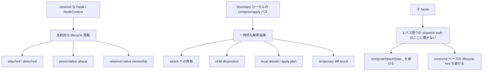

## 2. 現状の臭いと目標形

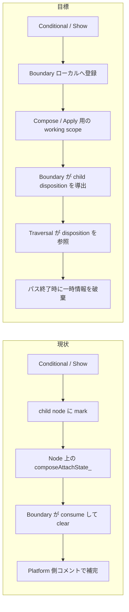

## 3. Dynamic から Static へのヒント

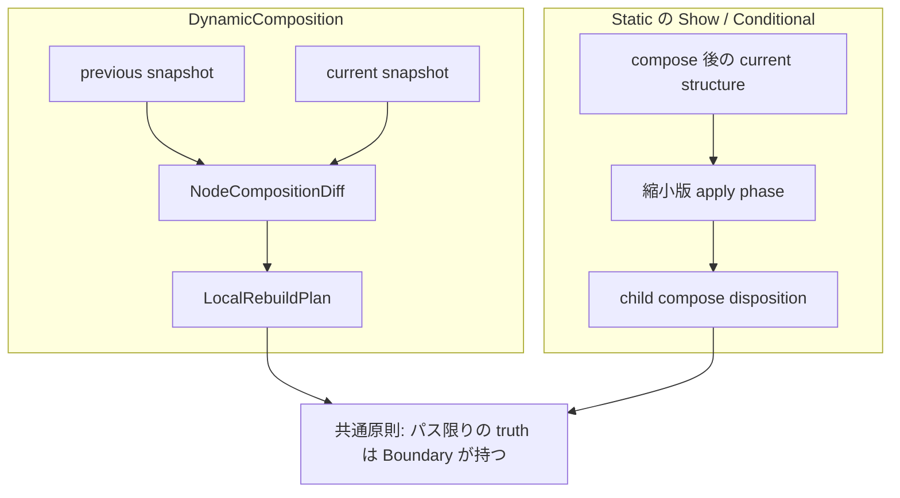

## 4. 足りないピースが挟まる場所

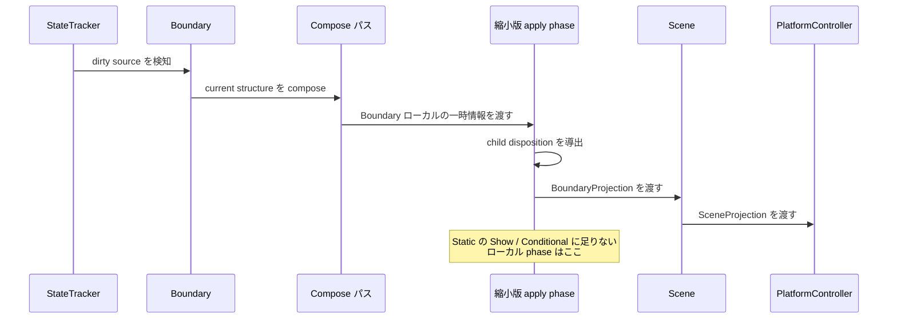

## 5. `ForEach<T>` への将来拡張

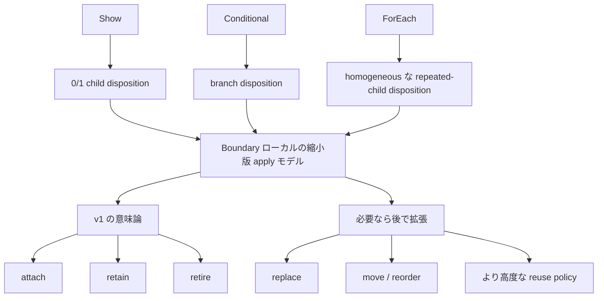

## 6. 命名の方向

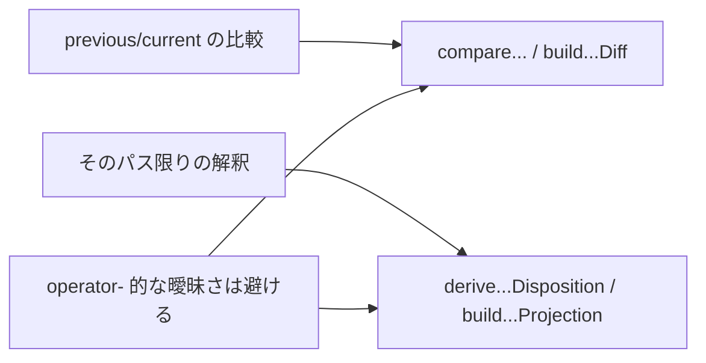

## 7. `markDirty` から反映までの流れ

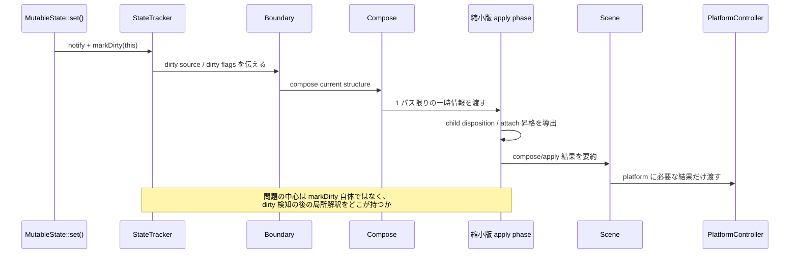

## 8. `markDirty` の現状と理想

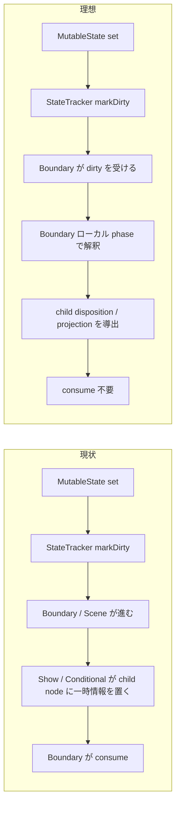

## 9. Projection の三層

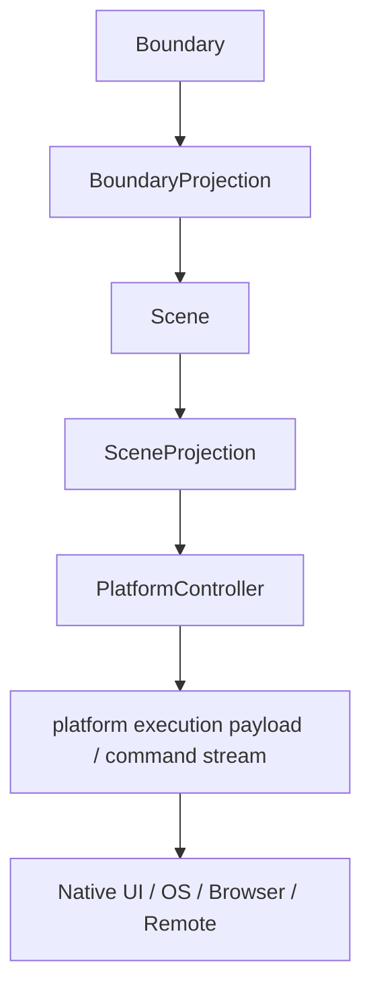

## 10. Update 全体像

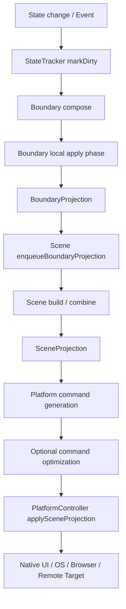

## 11. Scene が大事になる理由

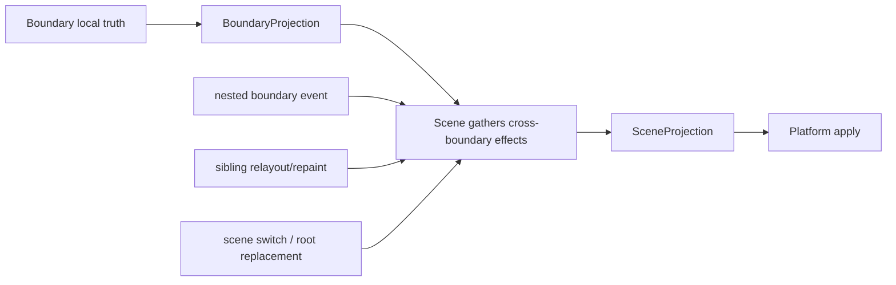

## 12. 将来のスレッド分離

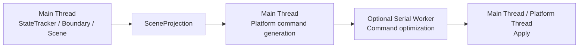

## 13. 論理UIと遅延ホストの関係

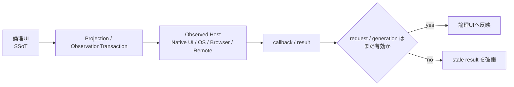

## 14. `nextTick` と将来の transaction の役割分担

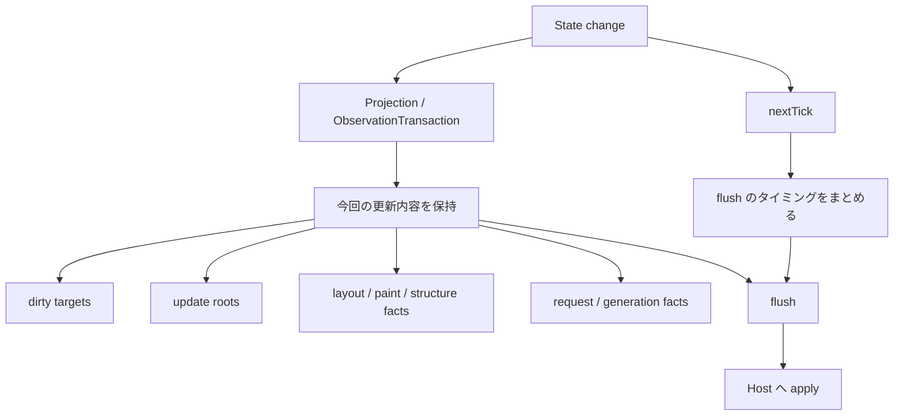

## 15. 寿命と owner の原則

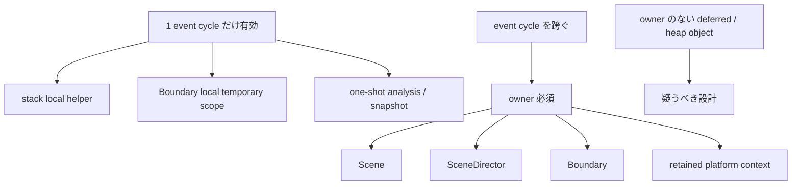

## 16. Transaction の起点と commit

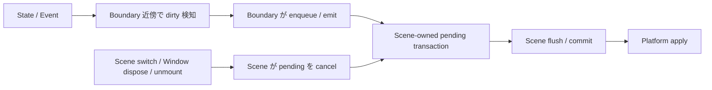

## 15. 火星通信メタファ

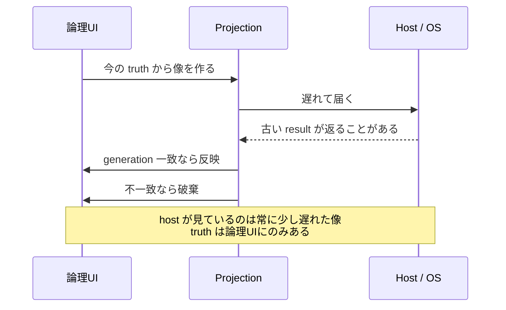
