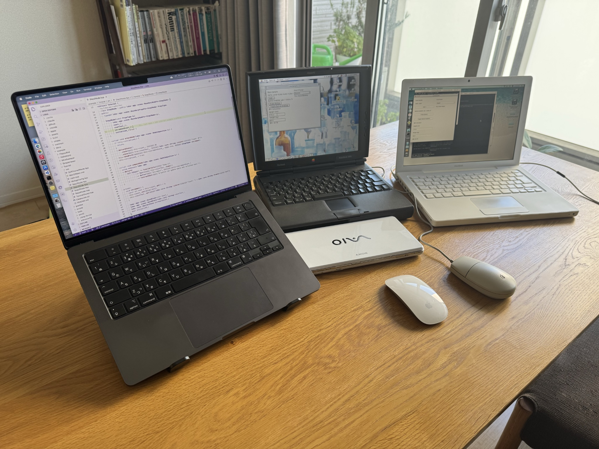

# Environments

This document separates the project environment into three roles:

- `Environment for Development`: where you edit, inspect, debug, and profile the project
- `Environment for Build`: where you actually compile and package targets
- `Environment for Target`: where the resulting binaries are expected to run

## Ultimate Loka Development Env.

The most capable all-around setup today is a modern macOS machine running VS Code, with Parallels Desktop used for Windows and optional Linux workflows, plus a 68k simulator for Classic validation.

This gives Loka a practical three-OS development loop today: modern macOS, Windows, and Classic Mac OS. Over time, the same host-centered workflow is expected to extend toward Linux, iOS / iPadOS, and Windows Mobile-class targets as support expands.

For Snow Leopard-oriented workflows, either a real machine or a virtualized Snow Leopard Server setup can be used. In both cases, file sharing from the main development machine makes build, debugging, and profiling workflows much easier.

## Environment for Development

This is the environment used for day-to-day development work.

- VS Code is the primary editor environment.
- Recommended VS Code extensions:
  - Microsoft's C/C++ extension
  - Microsoft's CMake Tools extension
  - LLVM's clangd extension for formatting and language intelligence
  - LLDB DAP to absorb ARM64 / x86_64 differences on macOS as automatically as possible
- CMake and Ninja can be installed through package managers such as `winget` and `Homebrew`.
- Those package-manager paths commonly provide CMake 3.x. If you specifically need the latest CMake 4.x series, use the official GUI installer rather than the CLI package-manager route, on both Windows and macOS.
- Debugging and profiling are typically done on modern host systems.
- On macOS, profiling generally requires the full `Xcode.app` installation in addition to Xcode Command Line Tools.
- Even on older environments where VS Code is not practical, macOS 10.8 and later can still use CMake's Xcode project generation path, making debugging and profiling possible through Xcode. The legacy Leopard/Snow Leopard bridge generators apply from 10.8 up to hosts that can run an Xcode 9-series toolchain; newer hosts (through Monterey 12) can still generate bridge projects by running them with `DEPLOYMENT_TARGET=10.9`. See [scripts/macos/README.md](../scripts/macos/README.md) for the verified routes and details.
- Once an Xcode project has been generated, older Apple IDEs can still be useful for debugging and profiling if the generated project remains compatible with that IDE version.
- For efficient cooperation with older Macs, it is often practical to enable file sharing on the main development machine and access the same source tree over LAN from another Mac. This works well with Mac OS X 10.6 and later, making it possible to build targets such as Universal Binary 1 directly against source managed on the main development side.
- Mac OS X 10.5 and earlier are not reliably compatible with that file-sharing path and may fail with protocol or connection errors. In those cases, use an intermediate Mac in roughly the 10.6 to 10.14 range, or copy sources by USB media.
- Modern macOS, Windows, and WSL are the most practical development hosts.
- This environment is mainly for editing, investigation, debugging, and iteration speed.

Typical examples:

- modern macOS on Apple Silicon or Intel
- modern Windows
- WSL2

## Environment for Build

This is the environment where binaries are actually built.

- Loka uses CMake + Ninja as the main build path.
- The project already builds with older toolchains such as GCC 4.0.
- Universal Binary 1 builds are possible on Snow Leopard systems.
- On older macOS systems such as Snow Leopard, CMake and Ninja can be installed through MacPorts.
- On Windows, VS Code should usually be launched from an appropriate Visual Studio Developer Command Prompt so that MSVC environment variables match the intended target architecture.
- On Windows on ARM, use the ARM64 Native Tools Command Prompt for native ARM64 builds, or ARM64_x86 / ARM64_x64 Cross Tools prompts for x86-family builds.
- Classic Toolbox targets are currently built through Retro68.
- Retro68 keeps the core portable while allowing modern host-side tooling for Classic builds.
- Retro68 workflows are not limited to Parallels Desktop. Docker, colima, WSL, and other Linux-oriented environments are also recommended.
- Retro68 is intentionally treated as a Linux-oriented build environment rather than something that must be installed directly on the host OS. This keeps the workflow easier to support and works well with VS Code, where separate windows can target different build environments and CMake configurations against the same source tree.
- When Retro68 builds are run inside Linux containers, Microsoft's Remote - SSH / WSL extensions are recommended for working with that environment from VS Code.
- Support for older toolchains such as Visual Studio 2005 and CodeWarrior Pro is planned.

Typical examples:

- modern macOS with current Clang / Xcode tools
- Snow Leopard for Universal Binary 1 workflows
- Linux or WSL2 for Retro68 builds
- macOS with Linux containers for Retro68 builds
- modern Windows with MSVC

## Environment for Target

This is the environment where the resulting application is meant to run.

- Classic Mac OS on 68k and PowerPC systems
- Mac OS X Tiger through Snow Leopard
- modern macOS
- Windows XP through current Windows
- Windows on ARM
- additional future targets such as iOS, Linux, and other platform ports

Typical examples:

- Classic Mac OS systems running on 68k or PPC hardware
- PowerBook G4 / older Mac OS X machines
- netbooks and low-end PCs
- modern MacBook systems
- ARM-based Windows devices
