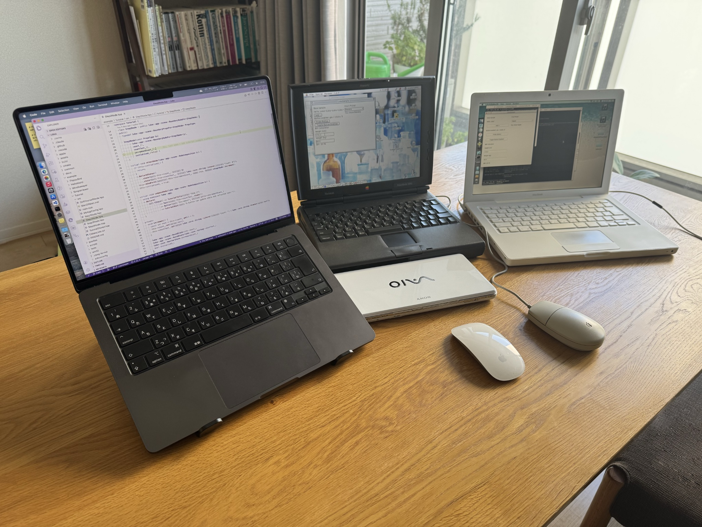

# Environments

This document separates the project environment into three roles:

- `Environment for Development`: where you edit, inspect, debug, and profile the project
- `Environment for Build`: where you actually compile and package targets
- `Environment for Target`: where the resulting binaries are expected to run

## Ultimate Loka Development Env.



The most capable all-around setup today is a modern macOS machine running VS Code, with Parallels Desktop used for Windows and optional Linux workflows, plus a 68k simulator for Classic validation.

This gives Loka a practical three-OS development loop today: modern macOS, Windows, and Classic Mac OS. Over time, the same host-centered workflow is expected to extend toward Linux, iOS / iPadOS, and Windows Mobile-class targets as support expands.

For Snow Leopard-oriented workflows, either a real machine or a virtualized Snow Leopard Server setup can be used. In both cases, file sharing from the main development machine makes build, debugging, and profiling workflows much easier.

## Environment for Development

This is the environment used for day-to-day development work.

- VS Code is the primary editor environment.
- Recommended VS Code extensions:
  - Microsoft's C/C++ extension
  - Microsoft's CMake Tools extension
  - LLVM's clangd extension for formatting and language intelligence
  - LLDB DAP to absorb ARM64 / x86_64 differences on macOS as automatically as possible
- CMake and Ninja can be installed through package managers such as `winget` and `Homebrew`.
- Those package-manager paths commonly provide CMake 3.x. If you specifically need the latest CMake 4.x series, use the official GUI installer rather than the CLI package-manager route, on both Windows and macOS.
- Debugging and profiling are typically done on modern host systems.
- On macOS, profiling generally requires the full `Xcode.app` installation in addition to Xcode Command Line Tools.
- Even on older environments where VS Code is not practical, macOS 10.8 and later can still use CMake's Xcode project generation path, making debugging and profiling possible through Xcode. The legacy Leopard/Snow Leopard bridge generators apply from 10.8 up to hosts that can run an Xcode 9-series toolchain; newer hosts (through Monterey 12) can still generate bridge projects by running them with `DEPLOYMENT_TARGET=10.9`. See [scripts/macos/README.md](../scripts/macos/README.md) for the verified routes and details.
- Once an Xcode project has been generated, older Apple IDEs can still be useful for debugging and profiling if the generated project remains compatible with that IDE version.
- For efficient cooperation with older Macs, it is often practical to enable file sharing on the main development machine and access the same source tree over LAN from another Mac. This works well with Mac OS X 10.6 and later, making it possible to build targets such as Universal Binary 1 directly against source managed on the main development side.
- Mac OS X 10.5 and earlier are not reliably compatible with that file-sharing path and may fail with protocol or connection errors. In those cases, use an intermediate Mac in roughly the 10.6 to 10.14 range, or copy sources by USB media.
- Modern macOS, Windows, and WSL are the most practical development hosts.
- This environment is mainly for editing, investigation, debugging, and iteration speed.

Typical examples:

- modern macOS on Apple Silicon or Intel
- modern Windows
- WSL2

## Environment for Build

This is the environment where binaries are actually built.

- Loka uses CMake + Ninja as the main build path.
- The project already builds with older toolchains such as GCC 4.0.
- Universal Binary 1 builds are possible on Snow Leopard systems.
- On older macOS systems such as Snow Leopard, CMake and Ninja can be installed through MacPorts.
- On Windows, VS Code should usually be launched from an appropriate Visual Studio Developer Command Prompt so that MSVC environment variables match the intended target architecture.
- On Windows on ARM, use the ARM64 Native Tools Command Prompt for native ARM64 builds, or ARM64_x86 / ARM64_x64 Cross Tools prompts for x86-family builds.
- For a host-native macOS standalone presentation, run
  `Verify: macOS Standalone Flow Release` in VS Code. The task configures and
  builds Release without pinning `CMAKE_OSX_ARCHITECTURES`, stages the complete
  application bundle under `build/presentation/macos-<host>-release`, launches
  it, requires the exact twelve-step success audit with its embedded
  deterministic verdict body, and stops the final
  scene hold. `Stage: macOS Standalone Flow Release` prepares the same portable
  directory without launching it; the tracked `standalone-tour.audit` byte
  authority is staged beside the verifier, while `ASSETS.LRP` remains owned by
  the bundle at `Contents/Resources`.
- For a presentation that keeps moving without a host controller, use the
  TEST-only HelloWorld and MineSweeper loop reels. Each application shows every
  registered cell for its example, wraps to the first, and continues until the
  user closes it. It reads no `LokaTest.cfg` and publishes no audit or capture
  marker.

  On macOS, build both reels from a Terminal opened at the repository root:

  ```sh
  cmake --preset macos-debug
  cmake --build build/macos/Debug --target LokaHelloWorldScenarioLoopMacOS LokaMineSweeperScenarioLoopMacOS
  open build/macos/Debug/apple/macos/LokaHelloWorldScenarioLoopMacOS.app
  open build/macos/Debug/apple/macos/LokaMineSweeperScenarioLoopMacOS.app
  ```

  The apps stop when the user chooses Quit or presses Command-Q. On Win32, use
  `Run (Windows HelloWorld Scenario Loop)` or
  `Run (Windows MineSweeper Scenario Loop)` for a Debug desk build. For a
  portable Release reel, use the architecture-specific presentation preset;
  for example, from an ARM64 Native Tools prompt:

  ```bat
  cmake --preset win32-arm64-release
  cmake --build --preset win32-scenario-loop-arm64-release
  start "" build\win32\presentation\arm64\Release\example\MineSweeper\scenario-loop\LokaMineSweeperScenarioLoopWin32.exe
  ```

  Substitute `x64` or `x86` in both preset names and the output path when using
  that compiler environment. To make a verification build stop after two
  complete passes, set `LOKA_SCENARIO_LOOP_CYCLES=2` in a separate build
  directory or cache so the ordinary desk build remains unbounded. On macOS:

  ```sh
  cmake -S . -B build/macos/Loop2 -G Ninja -DCMAKE_BUILD_TYPE=Debug -DLOKA_WARNINGS_AS_ERRORS=ON -DLOKA_SCENARIO_LOOP_CYCLES=2
  cmake --build build/macos/Loop2 --target LokaHelloWorldScenarioLoopMacOS LokaMineSweeperScenarioLoopMacOS
  open -W build/macos/Loop2/apple/macos/LokaHelloWorldScenarioLoopMacOS.app
  open -W build/macos/Loop2/apple/macos/LokaMineSweeperScenarioLoopMacOS.app
  ```

  On Win32, pass `-DLOKA_SCENARIO_LOOP_CYCLES=2` to the architecture-specific
  configure command and build from that separate cache.
- For a standalone presentation Release, start VS Code from the Visual Studio
  Command Line Tools session for the desired target, then run
  `Verify: Win32 Standalone Flow Release`. The task derives ARM64, x64, or
  x86/i386 from the inherited compiler environment. It uses a separate CMake
  cache for each architecture, verifies the resulting PE header, and stages
  the executable with `ASSETS.LRP` and the tracked `standalone-tour.audit`
  byte authority under
  `build/presentation/win32-<architecture>-release`. It then launches the app,
  waits for the exact twelve-step success audit with its embedded deterministic
  verdict, and stops the final-scene
  hold. Copy the staged directory to the target machine and run
  `powershell -ExecutionPolicy Bypass -File .\Verify-StandaloneFlow.ps1`
  there for a hardware check. The staged verifier derives the architecture
  from its sibling PE, starts the presentation, waits for the exact audit,
  stops the final-scene hold, and leaves `LOG.TXT` as the target-local runtime
  verdict. For a VAIO P, start VS Code from a VS2017 `x64_x86 Cross Tools`
  session; the task inherits that session's x86 target.
- Some endpoint scanners flag freshly linked unsigned test executables,
  particularly 32-bit ones.
  This workflow deliberately does not add an antivirus exclusion; use the
  machine's normal review/allow procedure or an approved target environment
  when local policy blocks the launch.
- Classic Toolbox targets are currently built through Retro68.
- Retro68 keeps the core portable while allowing modern host-side tooling for Classic builds.
- Retro68 workflows are not limited to Parallels Desktop. Docker, colima, WSL, and other Linux-oriented environments are also recommended.
- Retro68 is intentionally treated as a Linux-oriented build environment rather than something that must be installed directly on the host OS. This keeps the workflow easier to support and works well with VS Code, where separate windows can target different build environments and CMake configurations against the same source tree.
- When Retro68 builds are run inside Linux containers, Microsoft's Remote - SSH / WSL extensions are recommended for working with that environment from VS Code.
- Support for older toolchains such as Visual Studio 2005 and CodeWarrior Pro is planned.

Typical examples:

- modern macOS with current Clang / Xcode tools
- Snow Leopard for Universal Binary 1 workflows
- Linux or WSL2 for Retro68 builds
- macOS with Linux containers for Retro68 builds
- modern Windows with MSVC

## Environment for Target

This is the environment where the resulting application is meant to run.

- Classic Mac OS on 68k and PowerPC systems
- Mac OS X Tiger through Snow Leopard
- modern macOS
- Windows XP through current Windows
- Windows on ARM
- additional future targets such as iOS, Linux, and other platform ports

Typical examples:

- Classic Mac OS systems running on 68k or PPC hardware
- PowerBook G4 / older Mac OS X machines
- netbooks and low-end PCs
- modern MacBook systems
- ARM-based Windows devices

## Verification Status by Target

The sections above describe where Loka is meant to run. This one records how
far each target has actually been checked, so a claim can be traced to
evidence rather than to an intention. Use the terms from
[MAME_DEVELOPMENT.md](MAME_DEVELOPMENT.md): **build-verified** means it
compiled and linked, **runtime-verified** means it was launched and
exercised.

Emulation and hardware do different jobs. An emulator that exposes the
machine — MAME does, on 68K — is where an application can be inspected from
the inside; that is where the gdb workflow in
[MAME_DEVELOPMENT.md](MAME_DEVELOPMENT.md) applies, and being scriptable it
carries the automated scenarios. Hardware answers whether the result behaves
on a real machine. Neither substitutes for the other.

| Target | Status |
| --- | --- |
| Classic Mac OS, 68030 | Runtime-verified, under emulation and on hardware. The primary leg, and the only one that can be debugged at source level. |
| Classic Mac OS, 68020 / 68040 | Emulation only. No hardware, so timing observations are not measurements. |
| Classic Mac OS, PowerPC | Build-verified. Hardware is available for the runtime check; it has not been done yet. |
| Mac OS X, Tiger 10.4 | Runtime-verified for generated Universal Binary 1 samples. |
| Mac OS X, Leopard 10.5 | Build-verified through Xcode 3.x, with native debugging verified on that host. |
| Mac OS X, Snow Leopard 10.6 | Build-verified, including UB1 (`ppc/i386` and `ppc7400/i386/x86_64`). The bridge host for legacy builds. |
| Mac OS X on PowerPC hardware | Runtime-verified on an iBook, from bridge output that was also four-architecture `lipo`-verified. |
| Modern macOS | Runtime-verified on Apple silicon. |
| Windows, current | Runtime-verified on Windows 11 for ARM64 with ACP=932. |
| Windows XP class | Build target. Not runtime-verified. |
| Linux / WSL | Runtime-verified for the headless test suites. |

Hardware coverage is uneven, and the gaps shape what a result can mean. The
68K side rests on a single 68030 PowerBook, so 68020 and 68040 behaviour can
only be observed under emulation — useful for "does it still work", not for
"is it fast enough".

PowerPC divides by operating system rather than by hardware. Mac OS X on
PowerPC has been reached, including a runtime check on an iBook. **Classic**
Mac OS on PowerPC has not: the automated runtime scenarios are 68K only, so
that leg has never been exercised beyond building, even though the hardware
for it exists. That gap will not
be closed by the 68K tooling — the source-level debugging does not transfer;
see "Why this does not carry over to PPC" in
[MAME_DEVELOPMENT.md](MAME_DEVELOPMENT.md).

The legacy macOS toolchain matrix is recorded in more detail in
[../scripts/macos/README.md](../scripts/macos/README.md) — which host OS can
generate projects, debug, and drive Xcode 3.2.6 for Universal Binary builds.
That file is the detailed record for those rows; this table is the summary, so
add a leg there first and reflect it here rather than the other way round.

Emulator machine names elsewhere in this repository are examples of a working
configuration, not a statement about hardware.
