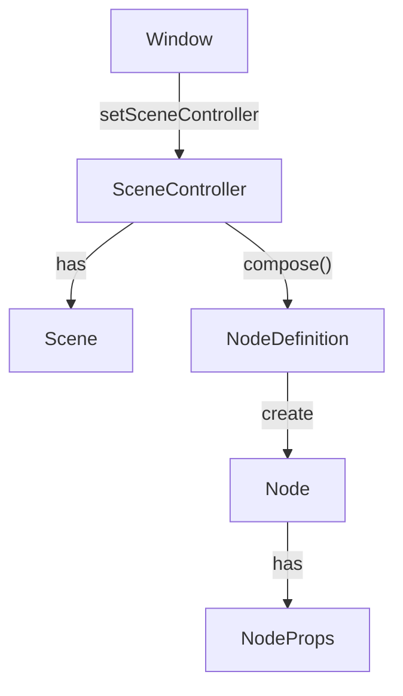

# core2 実装・設計進捗メモ

## 現状

- Scene/SceneController/SceneLifecycle/State<T>の基礎設計は完了
- SceneManager2 からの lifecycle 制御、SceneController による初回 compose 発火も OK
- State<T>は Scene/Props だけでなく Node ローカルにも必要（useState 的な仕組み要検討）

## 次にやるべきこと・検討スレッド

### 1. Node/Component ローカル State 管理 API

- Node 内部で useState<T>()/useDerivedState<T>()的な API を使い、Props や外部 State に依存しない一時値・派生値を安全に管理できるようにする
- Node のライフサイクルで State の生成・解放も自動化
- メモリ管理（RAII/参照カウント/GC）も考慮

### 2. Props in/out 設計

- Node が Props 経由で State を in/out できる設計例を作成
- 例: TextInput の value, onChange, カスタム Node の派生値 out

### 3. ノードツリーの所有・取得 API

- SceneController や Scene で compose 結果のノードツリーを所有・取得できるようにする
- Node\* root() const など

### 4. UI 部品の compose 連携テスト

- Scene サブクラスで Button 等を宣言し、SceneController 経由で compose→ ノード生成まで動作確認

### 5. 再 compose/差分適用の設計検討

- State 変化時の再 compose やノード差分更新の仕組みを設計（将来拡張）

---

## SceneController 設計方針

- Scene の管理・compose 戦略の切り替え・結果の保持は SceneController が担う
- Window::setSceneController で Window に SceneController をセット
- SceneController(scene) で Scene をラップ
- StaticSceneController（Solid.js 型）や DynamicSceneController（React 型）など、実装ごとに戦略を切り替え可能
- Scene は宣言的 UI 定義に専念し、更新戦略や状態保持は Controller 側で柔軟に拡張

- **SceneController**: Scene の管理・compose 戦略の切り替え・結果の保持を担う。Static/Dynamic など実装ごとに戦略を選択可能。
- **Window**: アプリのトップレベル UI。SceneController をセットし、UI 全体のライフサイクルを管理。
- **Scene**: 画面単位の宣言的 UI。Controller にラップされる。
- **NodeDefinition/Node/NodeProps**: これまで通り

> SceneController で戦略を切り替えることで、Scene 自体は宣言的 UI 定義に専念できる。

---

## State の所有・ライフサイクル設計方針

- **Node のメンバー State**

  - Node インスタンスと同じ寿命
  - Node の生成・破棄に合わせて State も自動管理（RAII）

- **NodeProps 経由の State**

  - Node が消滅しても State は存続（親や Scene が所有）
  - Scene のライフサイクル内で生存すれば十分
  - 親コンポーネントや Scene で定義 → 子にシェア（最も長生きな場所で定義）

- **設計メリット**
  - RAII 設計で C++らしい安全なリソース管理
  - State の所有者＝生存期間が明確
  - 親 → 子の State 共有も Props で自然に実現

> State の生存期間・所有権・共有は「一番長生きな場所で定義」が原則。これによりシンプルかつ堅牢な設計となる。

---

## NodeComposition の所有権・ライフサイクル設計

- 1 回の compose の結果（ノードツリーやメタ情報）を保持する一時オブジェクトとして NodeComposition のみで十分
- NodeComposition は「レンダリングした結果のスナップショット」として機能する
- Controller や Window は「最新の NodeComposition」だけを保持し、Node の所有・解放責任も NodeComposition 側に持たせる
- Node の参照は `composition.root()` で取得、解放は `delete composition;` で安全に破棄
- Solid 型/React 型ともに、compose ごとに新しい NodeComposition を生成・保持する設計が安全

> Controller/Window は「今の UI ツリーのスナップショット」を NodeComposition 経由で管理し、所有権・解放責任も明確に分離できる。

#### その他メモ

- SceneNodeGroup は現状使わない方針
- State<T>の API（deferBind, deferBindWithOld 等）は型・用途に注意
