# Update Pipeline Overview

This note organizes the main ideas around Loka's update / compose / apply flow
as diagrams.

It mainly covers:

- where responsibilities live
- how retained information differs from one-pass temporary interpretation
- what Boundary / Scene / Platform hand to each other

## 1. Persistent vs Temporary Information

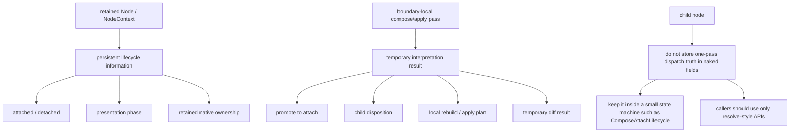

## 2. Current Shape and Intended Target

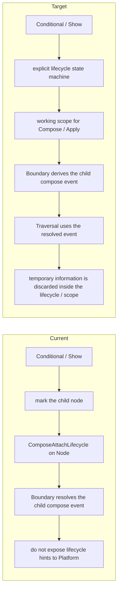

## 3. Hints from Dynamic to Static

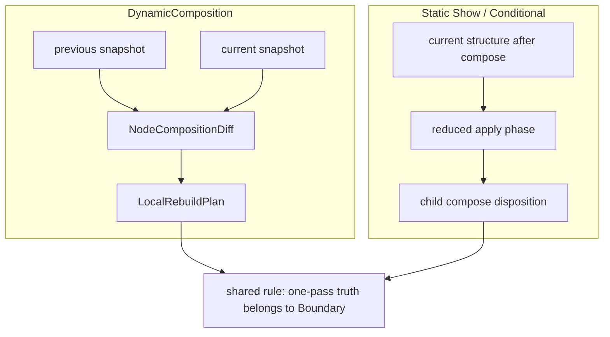

## 4. Where the Local Phase Fits

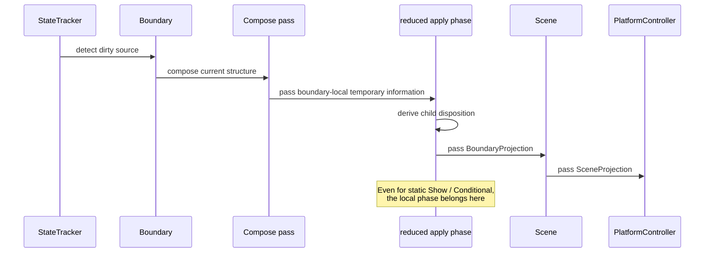

## 5. Future Extension Toward `ForEach<T>`

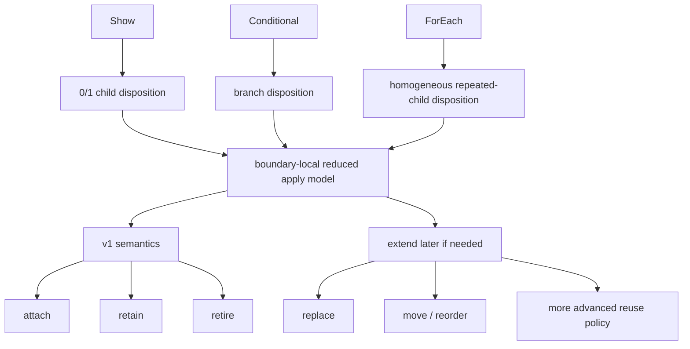

## 6. Naming Direction

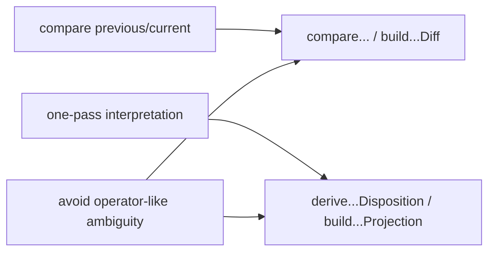

## 7. Flow from `markDirty` to Reflection

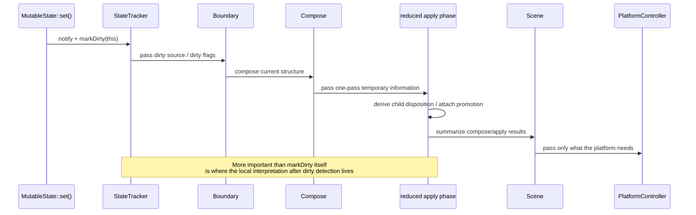

## 8. A Cleaner View of `markDirty`

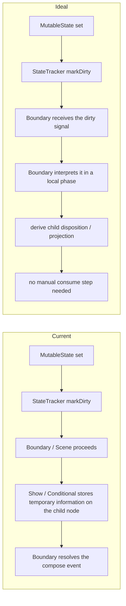

## 9. Three Layers of Projection

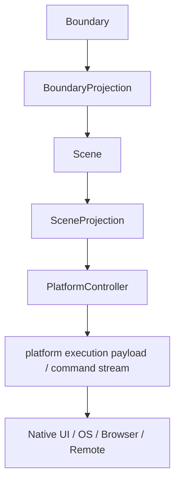

## 10. Overall Update Flow

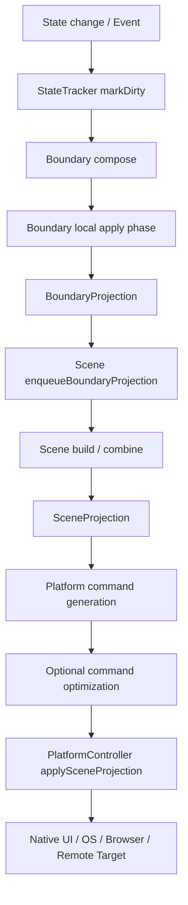

## 11. Why Scene Matters

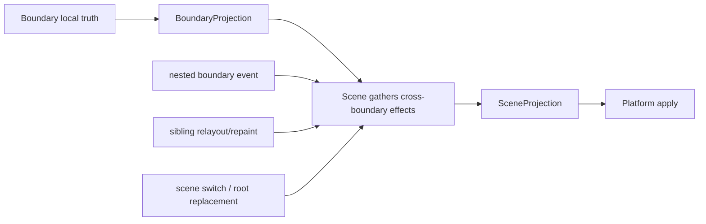

## 12. Future Thread Separation

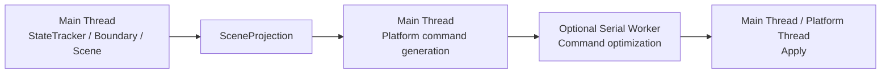

## 13. Logical UI and the Delayed Host

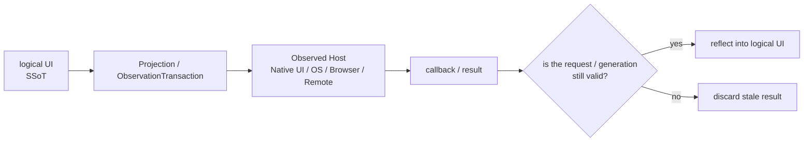

## 14. Division of Roles Between `nextTick` and Future Transactions

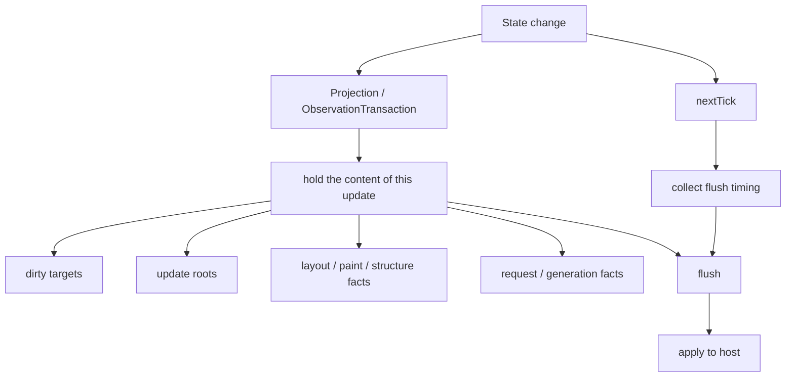

## 15. Lifetime and Owner Rules

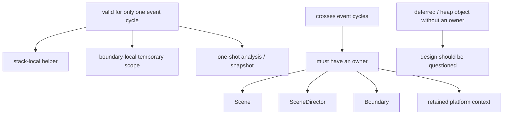

## 16. Transaction Start and Commit

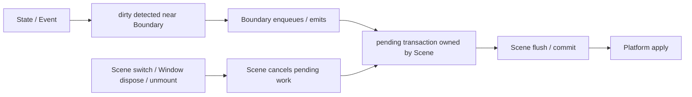

## 17. Mars Communication Metaphor

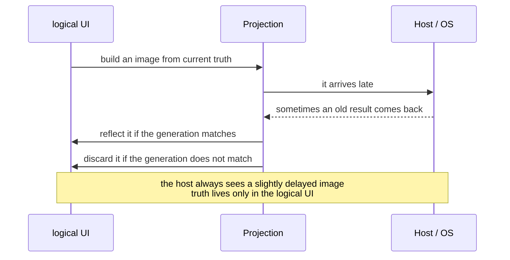
