# Update Pipeline Overview

This note organizes the main ideas around Loka's update / compose / apply flow
as diagrams.

It mainly covers:

- where responsibilities live
- how retained information differs from one-pass temporary interpretation
- what Boundary / Scene / Platform hand to each other

## 1. Persistent vs Temporary Information

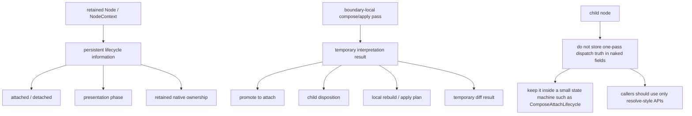
```mermaid
flowchart TD
    A[retained Node / NodeContext] --> B[persistent lifecycle information]
    B --> B1[attached / detached]
    B --> B2[presentation phase]
    B --> B3[retained native ownership]

    C[boundary-local compose/apply pass] --> D[temporary interpretation result]
    D --> D1[promote to attach]
    D --> D2[child disposition]
    D --> D3[local rebuild / apply plan]
    D --> D4[temporary diff result]

    E[child node] --> F[do not store one-pass dispatch truth in naked fields]
    F --> F1[keep it inside a small state machine such as ComposeAttachLifecycle]
    F --> F2[callers should use only resolve-style APIs]
```

## 2. Current Shape and Intended Target

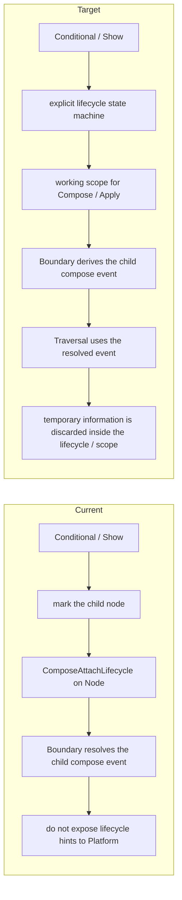
```mermaid
flowchart LR
    subgraph Current
        C1[Conditional / Show] --> C2[mark the child node]
        C2 --> C3[ComposeAttachLifecycle on Node]
        C3 --> C4[Boundary resolves the child compose event]
        C4 --> C5[do not expose lifecycle hints to Platform]
    end

    subgraph Target
        T1[Conditional / Show] --> T2[explicit lifecycle state machine]
        T2 --> T3[working scope for Compose / Apply]
        T3 --> T4[Boundary derives the child compose event]
        T4 --> T5[Traversal uses the resolved event]
        T5 --> T6[temporary information is discarded inside the lifecycle / scope]
    end
```

## 3. Compose Once, Update Seats

Every boundary, including the scene wrapper for a plain root, declares its
composition on ATTACH. UPDATE evaluates scheduled branch seats and walks the
existing children once. CHILD dirt by itself does not redeclare the root.
Std boundaries own their child ATTACH and UPDATE traversal, including when
nested: the enclosing generic walk stops at that boundary after dispatching
compose for either event. Custom boundary strategies that leave child traversal
to the generic walker retain that behavior through the default
`ownsChildTraversal(ComposeEvent)` contract.
On parked re-entry, an already composed Std boundary replays ATTACH through
its retained children without declaring its composition again.
Change the root's shape through `SceneManager::commitTransaction`, or put a
`Match` one level below it. Scene adoption updates a desired identity; `scene()`
and `getCurrentScene()` continue to expose the installed scene until the next
App admission. Pending replacement is the comparison of those identities.

The Window root seat prepares the candidate on its rail and composes it while
the old scene remains installed. Preparation withholds global native projection;
a refusal synchronously cleans the partial candidate, preserves the old scene,
and leaves the desired identity for retry at the next admission. After candidate
composition, preparation revalidates the Window's controller and native window;
loss of a mounted rail uses the same refusal cleanup. On Null, Win32, and macOS,
visibility writes carry close/show intent only. App admission
compares visibility with native presence and applies the final value before scene
work; false then true before admission performs no native work. Writes during
prepare or apply wait for the next admission for the same Window or an
already-applied row, preserving its live rail, while an earlier row's prepare
callback can still change a later, not-yet-applied row's visibility in the same
admission because visibility is read per row at apply time. Other
rails retain their existing visibility behavior. Win32 WM_DESTROY and macOS
windowWillClose remain closed facts: they sever native references and request
Window reclamation; scene teardown belongs to the App close drain. WM_CLOSE and
the macOS close box still take the default native destruction path. Programmatic
hide detaches native callback access before closing, keeping the logical Window
available for show. Installation
detaches the old scene, publishes the installed State, attaches the new scene,
projects the prepared root on the reused controller, then publishes ON_ATTACH.
Reentrant adoption during preparation or attachment only changes the next desired identity.
The constructor's initial scene is a synchronous seed; native creation mounts
it later. A Window without native resources likewise installs without mounting.

The seat also owns a last-request-wins detach/rearm value. Requesting either is
O(1) and never tears down the caller's composition. Detach destroys the installed
root and publishes ON_DETACH at admission. Rearm is forced generation renewal:
it detaches, creates a fresh root from the retained definition, and publishes
ON_ATTACH. Two equal requests collapse; detach then rearm means rearm, and the
reverse means detach. This is not representable by a final attached bool.

Admission takes the request before callbacks, attempts any desired replacement,
then applies the captured request to the resulting installed scene (the old
scene if replacement preparation was refused). Requests made by lifecycle
observers remain pending for the following admission. These requests own no
Scene identity and cannot retain a dangling reference. Rearm retains the previous
allocation-refusal behavior: an unsuccessful fresh composition is observable as
uncomposed. Its rearm request remains pending for the next admission unless a
newer observer request supersedes it; the existing white-flag recovery remains
available too. Scenario reels continue after this recoverable refusal. The request
has no synchronous success result. Scene's synchronous attach/detach, lifecycle
publication, and unmount
primitives are private to the seat, concrete Window teardown, and fixture access;
the initial mount/attach seed remains synchronous.

Only `App::flushWindowInvalidations` admits seat work, through private Window
members. The public Window flush runs current Scene/platform work and cannot
apply or reclaim replacements. App snapshots its admitted Window rows, applies
all selected seats, then runs their Scene flushes and native/Scene drains. Thus
an adoption during X's Scene run waits for the next App admission even on Y.
The existing App window-work guard refuses nested admission and close reclamation;
queued closes keep removed snapshot Windows alive until the following close drain.
Before applying each row, App excludes identities queued for terminal close by an
earlier callback, so their missing native presence cannot trigger recreation.
A direct `Scene::invalidate()` run can be active outside that App guard. App
excludes its Window from admission and Scene reclamation using the Scene's
tracker-derived `isRunInProgress()` capability; desired work waits until an
admission after the run returns.
Native command handlers request work; macOS's timer tick is its App clock.
Each Window captures its own retirement suffix before seat apply. Only that
suffix is reclaimed after its flush; newer retirements wait for the next one.
Thus a replacement requested during Scene apply requires the following admission to
install and one further admission to reclaim the outgoing scene. Superseded
unattached desired scenes enter the same pool immediately. Retired identities
cannot be adopted again. Outgoing-readoption contract: a scene adopted during
its own detach remains the detached desired scene without entering retirement;
the incoming install completes, and the following admission remounts the desired
scene with a fresh root generation. Window destruction disposes pending and
installed scenes even when no subsequent admission occurs.

Win32 and macOS OpenFileDialog completion uses the common `DialogResultTransport` owned by
each concrete Window (the Null test rail owns the same transport). Base
`Window` exposes only a nullable `DialogResultDelivery` admission view and stores
no transport. Its close hook also defaults to no work. Toolbox uses
these defaults; the common admission path cannot pull in concrete dialog
bindings or result payload code. The service
identity remains stable for the Window lifetime, including native hide/reopen.
The context owns a one-shot registration and deletes it on terminal
retirement, retained detach, or props retarget. Retained detach abandons a produced
result without emitting Canceled; reattach starts a fresh operation. Native return
seals through a revocable stack port, and posted wakes carry no C++ payload.
Failed posts and missing HWNDs leave completion work pending for admission.

Within App admission, native visibility applies first, followed by a finite batch
of that Window's results, then scene work. Delivery uses the full NodeState route.
Synchronous result observers may revoke the operation; emission requires both the
still-live registration and the emitter token acquired before the write. Active
entries survive those callbacks; retired entries are reclaimed silently from the
suffix captured at admission. All close and shutdown paths revoke transport work
before owners disappear. Win32's pre-wait progress query includes pending Window
closures as well as serviceable completion work, so observer-triggered close does
not need another native input. These completion semantics are pinned by the Null
contract adapter and macOS admission pins. macOS keeps its cancelable scheduled
presenter; native modal return only seals the revocable port, and MacApp's
repeating timer admits the result. This does not certify general native modal
stack safety or Toolbox completion.

This protocol spans adoption ownership, admission exclusion, preparation,
attachment, and four platform rails. Its risk review covers five areas: new
lifecycle paths, multiple identity fields, State/Boundary/Platform boundaries,
changed detach/dirty ordering, and preparation before native creation. Null
ownership/refusal/reentry pins cover the portable behavior. Win32 and macOS
SmirkyCard real clicks and Toolbox replacement on the Classic rig remain the
runtime verification legs; host and Retro68 compilation do not prove those
native behaviors. Native close, direct detach/rearm, posted callback cancellation,
and Toolbox pool retention policy remain separate hardening work.

Parked-branch re-entry retains its definition-tree comparison and local apply
plan. That comparison belongs to the seat; there is no boundary-wide pair of
composition snapshots. The Scene's full-rebuild request survives as a platform
re-projection request, including recovery after an allocation refusal. It does
not enable logical root rebuilding on UPDATE.

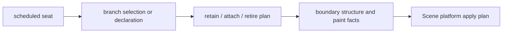
```mermaid
flowchart LR
    A[scheduled seat] --> B[branch selection or declaration]
    B --> C[retain / attach / retire plan]
    C --> D[boundary structure and paint facts]
    D --> E[Scene platform apply plan]
```

## 4. Where the Local Phase Fits

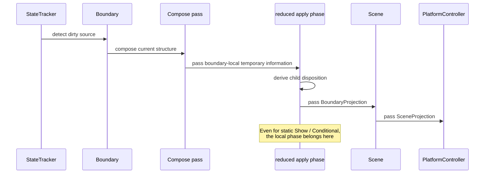
```mermaid
sequenceDiagram
    participant ST as StateTracker
    participant B as Boundary
    participant C as Compose pass
    participant A as reduced apply phase
    participant SC as Scene
    participant PC as PlatformController

    ST->>B: detect dirty source
    B->>C: compose current structure
    C->>A: pass boundary-local temporary information
    A->>A: derive child disposition
    A->>SC: pass BoundaryProjection
    SC->>PC: pass SceneProjection

    Note over A: Even for static Show / Conditional,<br/>the local phase belongs here
```

## 5. Future Extension Toward `ForEach<T>`

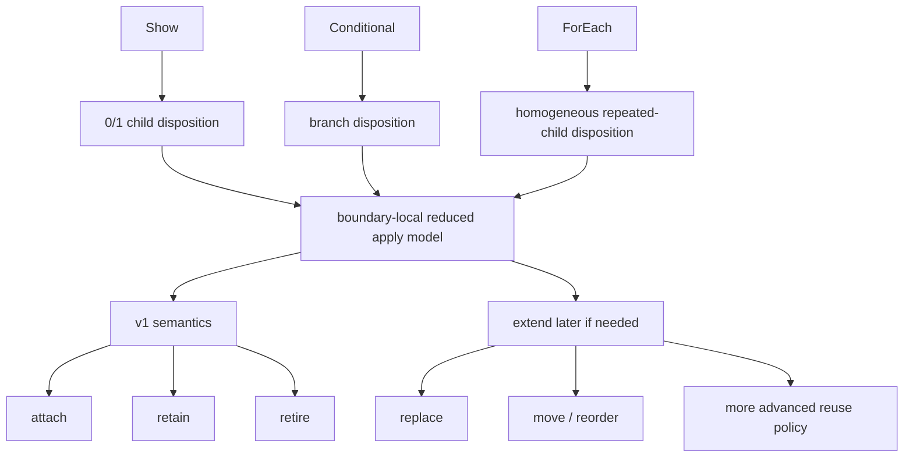
```mermaid
flowchart TD
    A[Show] --> A1[0/1 child disposition]
    B[Conditional] --> B1[branch disposition]
    C[ForEach<T>] --> C1[homogeneous repeated-child disposition]

    A1 --> D[boundary-local reduced apply model]
    B1 --> D
    C1 --> D

    D --> E[v1 semantics]
    E --> E1[attach]
    E --> E2[retain]
    E --> E3[retire]

    D --> F[extend later if needed]
    F --> F1[replace]
    F --> F2[move / reorder]
    F --> F3[more advanced reuse policy]
```

## 6. Naming Direction

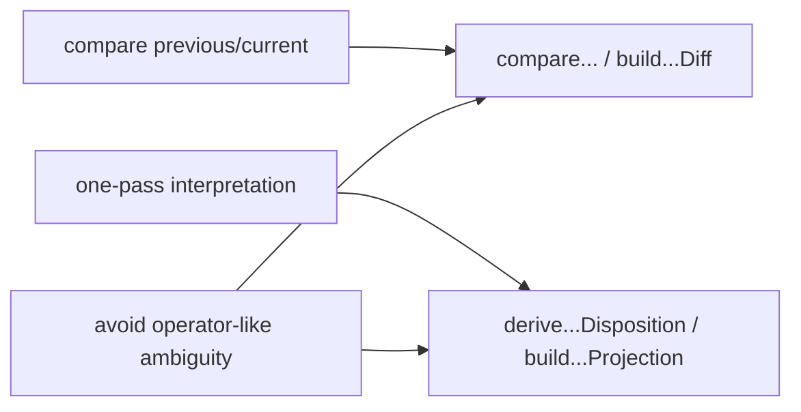
```mermaid
flowchart LR
    A[compare previous/current] --> B[compare... / build...Diff]
    C[one-pass interpretation] --> D[derive...Disposition / build...Projection]

    E[avoid operator-like ambiguity] --> B
    E --> D
```

## 7. Flow from `markDirty` to Projection

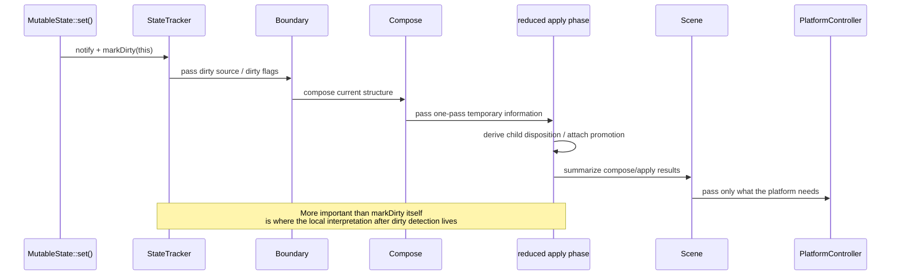
```mermaid
sequenceDiagram
    participant S as MutableState::set()
    participant T as StateTracker
    participant B as Boundary
    participant C as Compose
    participant A as reduced apply phase
    participant SC as Scene
    participant PC as PlatformController

    S->>T: notify + markDirty(this)
    T->>B: pass dirty source / dirty flags
    B->>C: compose current structure
    C->>A: pass one-pass temporary information
    A->>A: derive child disposition / attach promotion
    A->>SC: summarize compose/apply results
    SC->>PC: pass only what the platform needs

    Note over T,A: More important than markDirty itself<br/>is where the local interpretation after dirty detection lives
```

## 8. A Cleaner View of `markDirty`

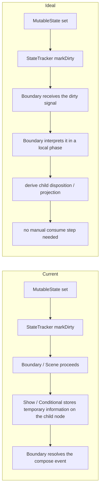
```mermaid
flowchart LR
    subgraph Current
        C1[MutableState set] --> C2[StateTracker markDirty]
        C2 --> C3[Boundary / Scene proceeds]
        C3 --> C4[Show / Conditional stores temporary information on the child node]
        C4 --> C5[Boundary resolves the compose event]
    end

    subgraph Ideal
        T1[MutableState set] --> T2[StateTracker markDirty]
        T2 --> T3[Boundary receives the dirty signal]
        T3 --> T4[Boundary interprets it in a local phase]
        T4 --> T5[derive child disposition / projection]
        T5 --> T6[no manual consume step needed]
    end
```

## 9. Three Layers of Projection

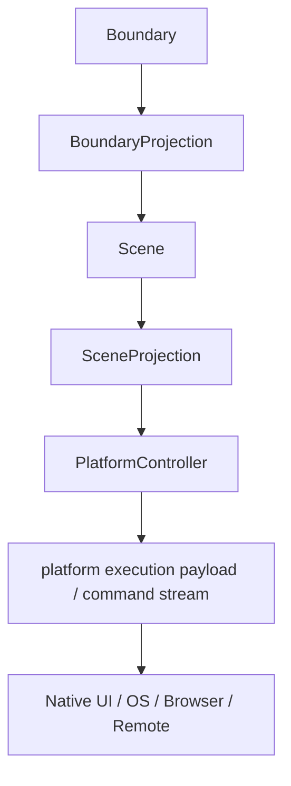
```mermaid
flowchart TD
    A[Boundary] --> B[BoundaryProjection]
    B --> C[Scene]
    C --> D[SceneProjection]
    D --> E[PlatformController]
    E --> F[platform execution payload / command stream]
    F --> G[Native UI / OS / Browser / Remote]
```

## 10. Overall Update Flow

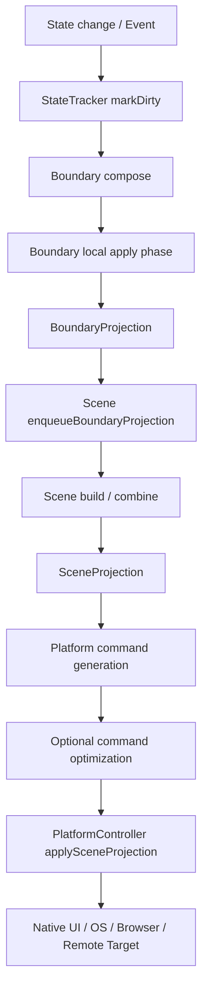
```mermaid
flowchart TD
    A[State change / Event] --> B[StateTracker markDirty]
    B --> C[Boundary compose]
    C --> D[Boundary local apply phase]
    D --> E[BoundaryProjection]

    E --> F[Scene enqueueBoundaryProjection]
    F --> G[Scene build / combine]
    G --> H[SceneProjection]

    H --> I[Platform command generation]
    I --> J[Optional command optimization]
    J --> K[PlatformController applySceneProjection]
    K --> L[Native UI / OS / Browser / Remote Target]
```

## 11. Why Scene Matters

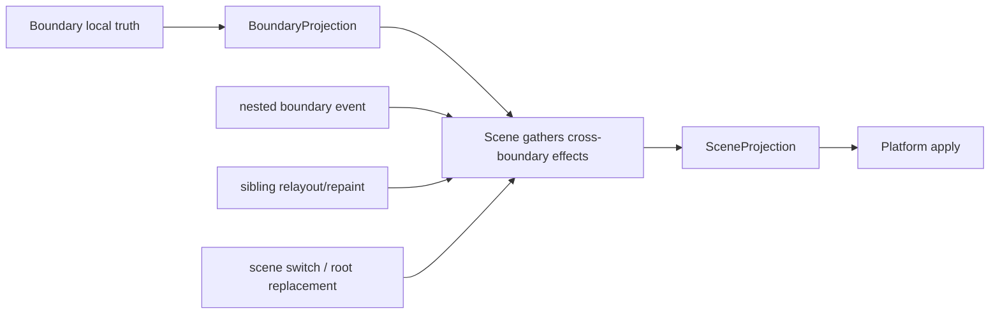
```mermaid
flowchart LR
    A[Boundary local truth] --> B[BoundaryProjection]
    B --> C[Scene gathers cross-boundary effects]
    C --> D[SceneProjection]
    D --> E[Platform apply]

    F[nested boundary event]
    G[sibling relayout/repaint]
    H[scene switch / root replacement]

    F --> C
    G --> C
    H --> C
```

## 12. Future Thread Separation

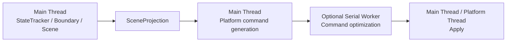
```mermaid
flowchart LR
    A[Main Thread<br/>StateTracker / Boundary / Scene] --> B[SceneProjection]
    B --> C[Main Thread<br/>Platform command generation]
    C --> D[Optional Serial Worker<br/>Command optimization]
    D --> E[Main Thread / Platform Thread<br/>Apply]
```

## 13. Logical UI and the Delayed Host

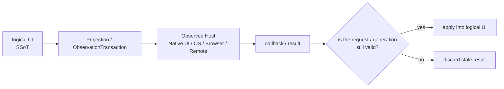
```mermaid
flowchart LR
    A[logical UI<br/>SSoT] --> B[Projection / ObservationTransaction]
    B --> C[Observed Host<br/>Native UI / OS / Browser / Remote]

    C --> D[callback / result]
    D --> E{is the request / generation<br/>still valid?}
    E -->|yes| F[apply into logical UI]
    E -->|no| G[discard stale result]
```

## 14. Division of Roles Between `nextTick` and Future Transactions

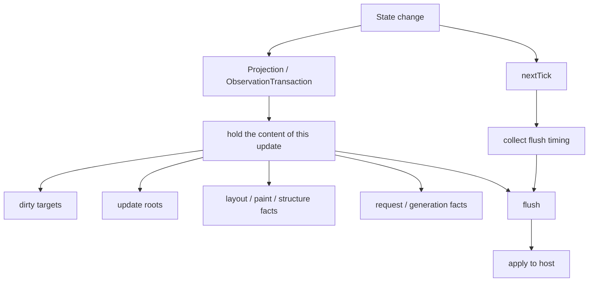
```mermaid
flowchart TD
    A[State change] --> B[nextTick]
    B --> C[collect flush timing]

    A --> D[Projection / ObservationTransaction]
    D --> E[hold the content of this update]
    E --> E1[dirty targets]
    E --> E2[update roots]
    E --> E3[layout / paint / structure facts]
    E --> E4[request / generation facts]

    C --> F[flush]
    E --> F
    F --> G[apply to host]
```

## 15. Lifetime and Owner Rules

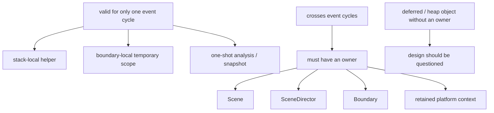
```mermaid
flowchart TD
    A[valid for only one event cycle] --> A1[stack-local helper]
    A --> A2[boundary-local temporary scope]
    A --> A3[one-shot analysis / snapshot]

    B[crosses event cycles] --> B1[must have an owner]
    B1 --> B2[Scene]
    B1 --> B3[SceneDirector]
    B1 --> B4[Boundary]
    B1 --> B5[retained platform context]

    C[deferred / heap object without an owner] --> D[design should be questioned]
```

## 16. Transaction Start and Commit

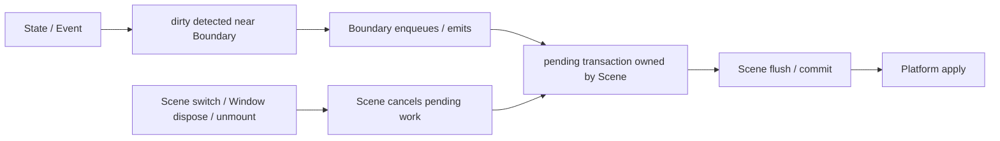
```mermaid
flowchart LR
    A[State / Event] --> B[dirty detected near Boundary]
    B --> C[Boundary enqueues / emits]
    C --> D[pending transaction owned by Scene]
    D --> E[Scene flush / commit]
    E --> F[Platform apply]

    G[Scene switch / Window dispose / unmount] --> H[Scene cancels pending work]
    H --> D
```

## 17. Mars Communication Metaphor

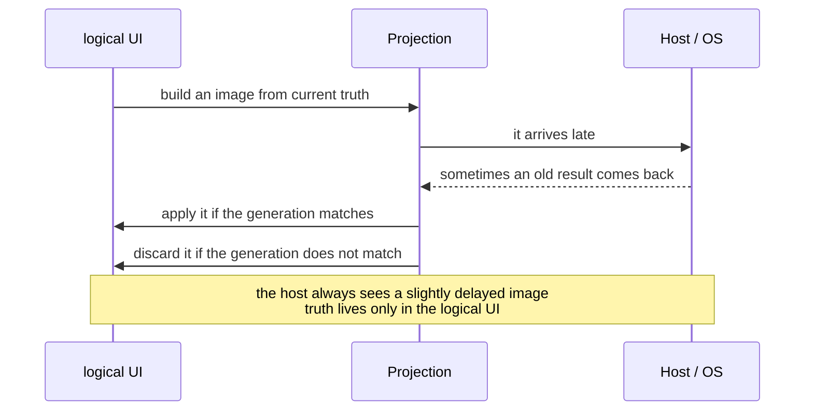
```mermaid
sequenceDiagram
    participant L as logical UI
    participant P as Projection
    participant H as Host / OS

    L->>P: build an image from current truth
    P->>H: it arrives late
    H-->>P: sometimes an old result comes back
    P->>L: apply it if the generation matches
    P->>L: discard it if the generation does not match

    Note over L,H: the host always sees a slightly delayed image<br/>truth lives only in the logical UI
```
